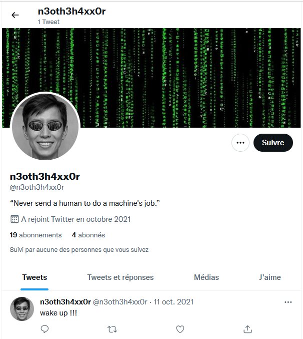
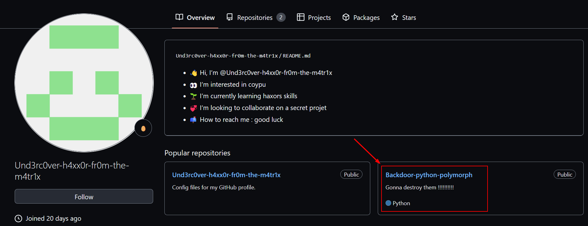
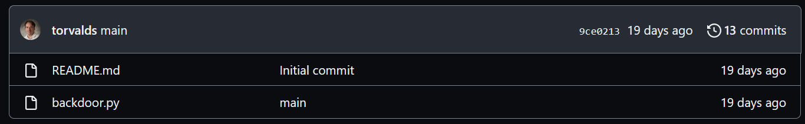
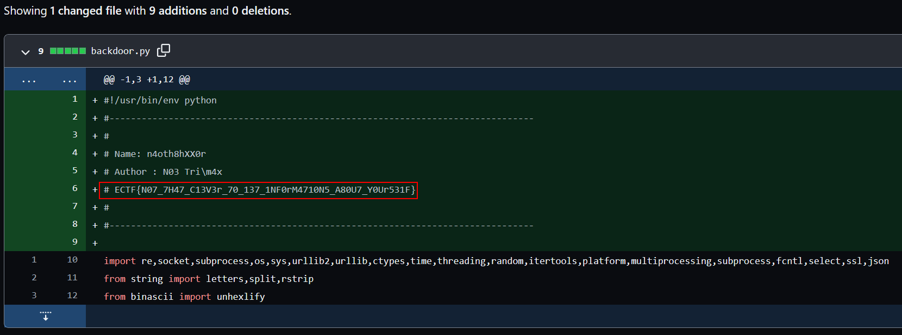

# [ESAIP CTF 2022] - The Proof of the Malware


Here is the writeup of `The Proof of the Malware`, a cool OSINT challenge categorized as `medium` during the **ESAIP CTF.** 

After some time without anybody solving the challenge I managed to first blood it🩸. 


## Instructions

```
We have discovered that a person currently working at Metacortexxs is 
developing a powerful virus. Find the proof of the development of this 
virus by this employee
```

## Information Gathering - Finding the target

According to the instructions, we are searching for someone who is working at `Metacortexxs`. 

The first idea that came into my mind is to do some research on **LinkedIn**. To do this, I used a simple Google dork :

```
site:linkedin.com "megacortexxs"
```

The first result seemed interesting. 


Apparently, there is a certain `Noe Trimax` working at `Metacortexxs` as **Informatics Specialist**. Interesting 👀. So I went on his profile to find some more informations. 

  ****


As you can see, I saw there was some additionnal contact informations on his profile. 

In order to see this, you have to be logged in on a LinkedIn account. Otherwise you’ll miss it !


The investigation proceeds with the finding of his email. 

```
n3oth3h4xx0r@protonmail.com
```

---

## Pivoting - Let’s find the malware

I can now pivot on [EPIOS](https://epieos.com/). For those who doesn’t know the tool, it is an OSINT search engine that allows performing reverse email search. Using it, I am able to retrieve information linked to an email address without notifying the user. 


Thanks to `Holehe`, we can see that Noe’s email is used on two different websites : **Github** and **Twitter**. Since we have to find the proof of the development of a virus, the github seems to be the most interesting place. But let’s see if I can find something interesting on his Twitter account (like a link to his github profile for example). 

### Twitter - A (white) rabbit hole

In order to find his Twitter account, I just typed his username : `n3oth3h4xx0r`



Sadly, there’s nothing interesting on his profile. But I liked his bio. (:

### Github - Not stealthy enough, Noé

Here’s the tricky part of the challenge. I had to use a technique that is not very well known in order to find his github profile. Because yes, it is actually possible to find a Github username only with the associated email. 

To do so, I needed to make a commit on a personal repository with the flag `--author`. The value of this flag must respect the following format : `--author="Name <email@domain.tld>"`. In this case, I ran the following commands : 

```bash
git commit --author="Test <n3oth3h4xx0r@protonmail.com>" -m "test"
git push origin main
```

Then, I went on [Github](https://github.com/) in order to find out Noe’s account :


Hmm, so he is the so-called `Und3rc0ver-h4xx0r-fr0m-the-m4tr1x`. The cover is burnt Noé. 

By going on his profile, I can see there’s an interesting repo :



The repo called `Backdoor-python-polymorph` is very suspicious, right ? Let’s see what’s in there. 



It looks like we’ve found our virus development proof here. I was quite chocked when I found out that Linus Torvald was involved though 😢 ! 

## Finding the flag - Commits

Now we have to find the flag. Let’s see the commits : 


We can see there’s plenty of them. After some manual inspection, the `added bin and header` one contains what I was looking for : the flag. 



Flag : `ECTF{N07_7H47_C13V3r_70_137_1NF0rM4710N5_A80U7_Y0Ur531F}`

Thanks to the author [Hippie](https://hippie.cat/) for this challenge. It was very entertaining and it was a great opportunity to put some light on this secret github technique.
