# Malware Analysis : WannaCry (part 1)


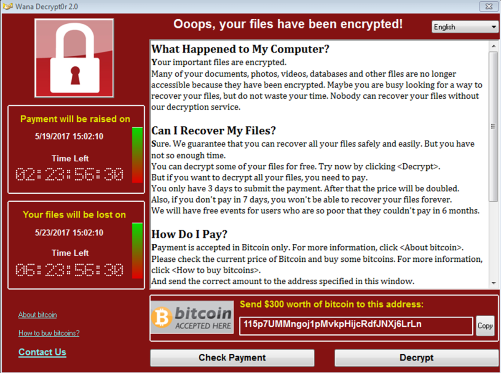


| Difficulty | Start Date & Time  | Finish Date & Time |
| ---------- | ------------------ | ------------------ |
| Medium     | 24/11/2023 - 16h45 | 26/11/2023 - 19h30 | 

## Introduction

In the early summer of 2017, WannaCry was unleashed on the world. Widely considered to be one of the most devastating malware infections to date, WannaCry left a trail of destruction in its wake. WannaCry is a classic ransomware sample; more specifically, it is a ransomware cryptoworm, which means that it can encrypt individual hosts and had the capability to propagate through a network on its own.

(*If you want more information about WannaCry, I strongly recommand you to listen to Darknet Diaries's podcast on the subject: https://darknetdiaries.com/episode/73/*)


---
## Objective

```
Perform a full analysis of WannaCry and answer the questions below.
```

---
## Tools

### Basic Analysis
- File hashes
- VirusTotal
- FLOSS
- PEStudio
- PEView
- Wireshark
- Inetsim
- TCPView
- Procmon

### Advanced Analysis
- Cutter
- Debugger (x64dbg)

---
## Basic Facts

**SHA256:**
```
24d004a104d4d54034dbcffc2a4b19a11f39008a575aa614ea04703480b1022c
```

**MD5:**
```
db349b97c37d22f5ea1d1841e3c89eb4
```

**VirusTotal:**

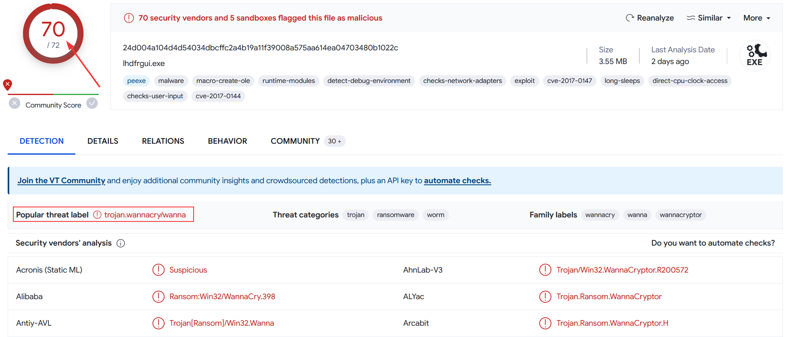

Obviously, the file was flagged as malicious. It's flagged by 70 security vendors and the most popular threat label is `wannacry`. I might as well tell you that it's spotted miles away. But for the purpose of this challenge, I won't take it in consideration in order to find everything by myself, as if I was the first person to be infected by WannaCry 😼! How lucky...

---
## Challenge Questions

#### Record any observed symptoms of infection from initial detonation. What are the main symptoms of a WannaCry infection?

When detonating WannaCry for the first time, I noticed several symptoms of infection. 

1) Different files were created or modified

	- `@Please_Read_Me@.txt`: it contains a brief explanation of what happened and the instructions on how to fix it (i.e how to pay the ransom and get my files decrypted).
	
	- `@WanaDecryptor@.exe`: . this is the binary in charge of decrypting my files when the ransom will be paid. In the meantime, it gives different informations (*detailed below*). I  also noticed that most of my executable files were modified to `@WanaDecryptor@.exe`. Below you will find a screenshot of the associated window.
	
	- `@WanaDecryptor@.exe.lnk`: this is a shortcut to `@WanaDecryptor@.exe`. I noticed that most of my shortcuts were modified to point on it.
	
	- `@WanaDecryptor@.bmp`: this is the new desktop wallpaper that will be replacing . 
	
	- `[filename].WNCRY`: I noticed most of my files were encrypted and their name appended with this extension.

1) The desktop background has been replaced by this ✨cute✨ message :

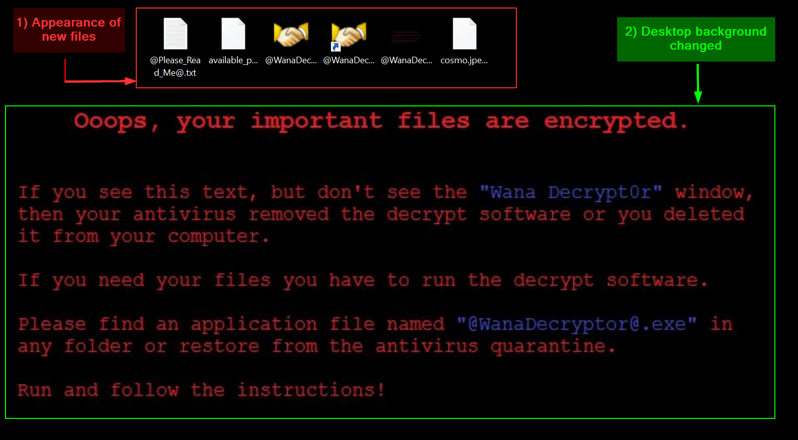


3) The following pop-up window appeared. It can be spawned manually by executing `@WanaDecryptor@.exe`.

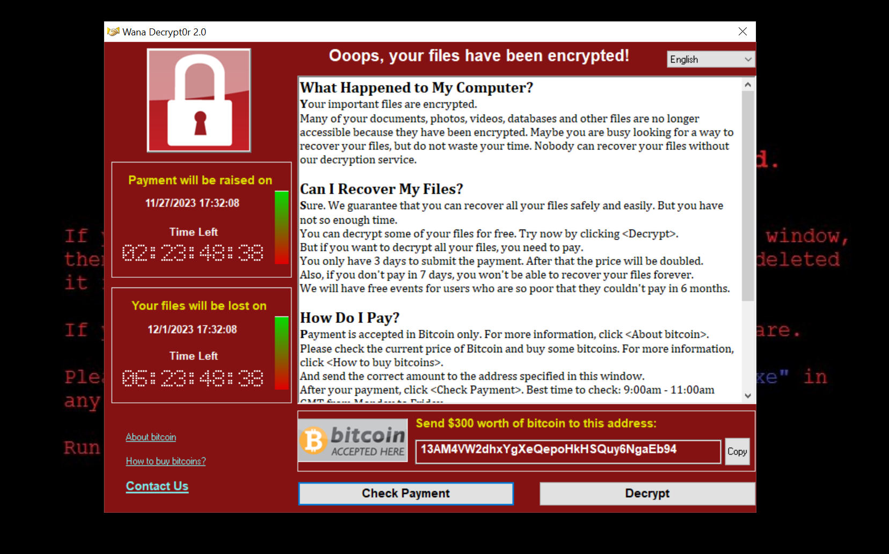

I can see a lot of informations.

**On the left**
- when will the payment be raised on,
- when my files will be lost on,
- what is bitcoin and how to buy it.

**In the main window**
- informations on what happened to my computer,
- informations on how to recover my files,
- informations on how to pay
- contact details.

**On the bottom**
- the amount in dollars of the ransom,
- the bitcoin address to which payment should be sent,
- a *Check Payment* button,
- a *Decrypt* button.


---
#### Use FLOSS and extract the strings from the main WannaCry binary. Are there any strings of interest?

Using FLOSS, I  extracted several interesting strings from the main WannaCry binary. First of all I noticed the following :

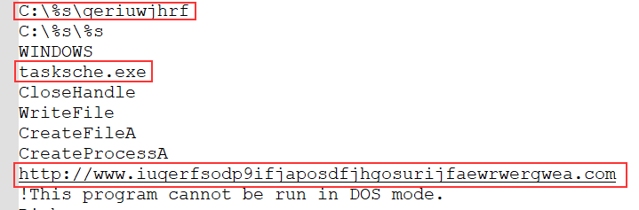

```
C:\%s\qeriuwjhrf
tasksche.exe
http://www.iuqerfsodp9ifjaposdfjhgosurijfaewrwergwea.com
```

The first string is an absolute path to a file. At this point, I have no idea of what it could be but its name is composed of random letters probably to hide its real meaning and  purpose. The second string is the name of an EXE file (`tasksche.exe`) similar to the official one for the `Task Scheduler` which is `taskschd.exe` 🤔. The third string is an URL to a strange website composed of random characters. It's probably used later during the execution of the malware.

Then, I noticed some more interesting strings associated to cryptography and command execution.

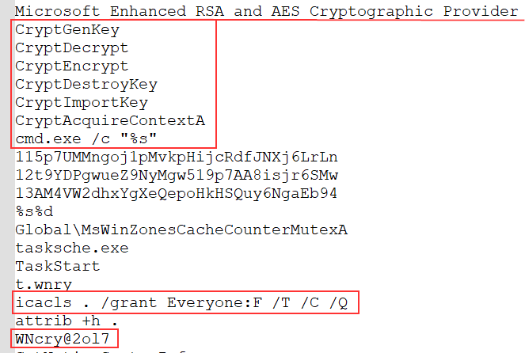

```
CryptGenKey
CryptDecrypt
CryptEncrypt
...

cmd.exe /c "%s"
icacls . /grant Everyone:F /T /C /Q
attrib +h .

WNcry@2o17
```

It looks like this malware is using cryptographic functions from the header `wincrypt.h`, probably to encrypt files. Also, I can see some system commands like `cmd.exe /c` or `icacls` related to file and directory access control lists. and `attrib +h .` which is setting the hidden file attribute. Additionnally, I noticed the string `WNcry@2o17`. I don't know what is its purpose but from my perspective it looks like a password or something like that. 

I also noticed UNC (*Universal Naming Convention*) paths. This is a mean to specify location of network resources in the context of a LAN.

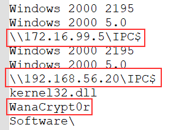

```
\\172.16.99.5\IPC$
\\192.168.56.20\IPC$

WanaCrypt0r
```

Here, both of the UNC paths are leading to the `IPC$` share. Microsoft officially state :

> "*The IPC$ share is also known as a null session connection. By using this session, Windows lets anonymous users perform certain activities, such as enumerating the names of domain accounts and network shares.*"

So WannaCry is probably enumerating systems for specific informations it needs.

`WanaCrypt0r` is also a string that attracted my attention. I suppose it's probably the name of a function or a binary.

Finally, these are the last couple of strings I noticed.

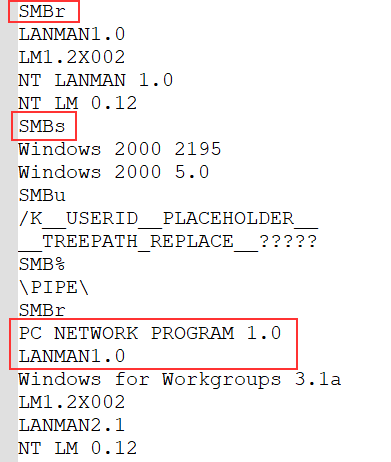

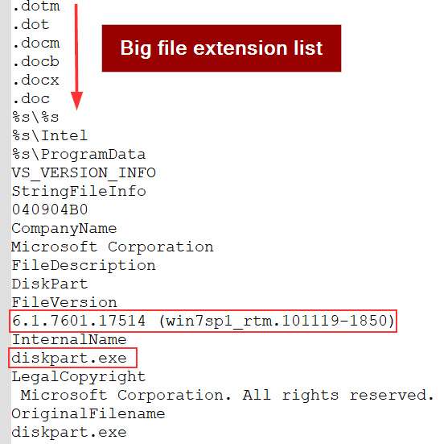

```
SMBr
SMBs
PC NETWORK Program 1.0
LAN MAN1.0

6.1.7601.17514 (win7sp1_rtm.101119-1850)
```

The first couple of strings are related to the usage of the SMB (*Server Message Block*) protocol. It allows sharing resources (files and directories) through the local network between Windows machines. As Microsoft states : 

>"In the protocol negotiation process, SMB dialects are identified by Dialect Identifier Strings. For example, the **Core Protocol** is identified by two strings: "PCLAN1.0" or "PC NETWORK PROGRAM 1.0". Either or both of these strings can be sent by the client.""

There's also a long list of file extensions. I suppose this is to know which file to encrypt (or not?), which file to substitute for `@WanaDecryptor@.exe` or for modifying shortcuts to point to it. 

Lastly, there's a string related to a specific build and version of Windows 7. It's probably necessary for WannaCry to have this information (maybe to compare it with the result of its machine enumeration).


---
#### Inspect the import address table for the main WannaCry binary. Are there any notable API imports?

To inspect the Import Address Table (**IAT**) for the main WannaCry binary to check if there are any notable API imports, I used `PEStudio` along with [MalAPI](https://malapi.io/winapi/GetAdaptersInfo) to get some more informations about certain functions. 

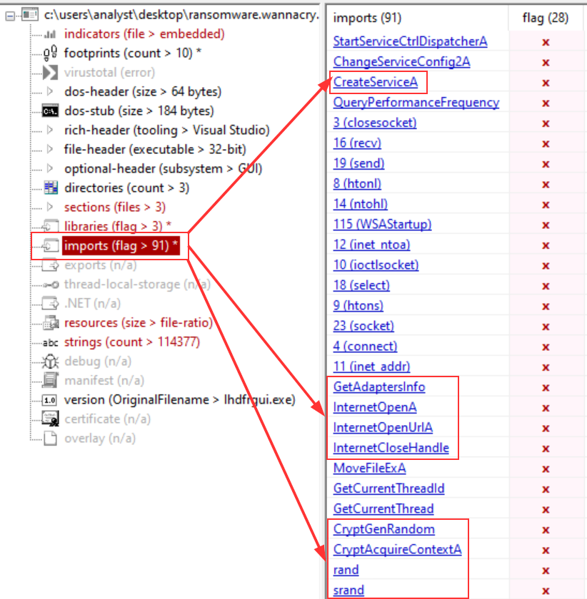

You can see there's over **91 imports** flagged as suspicious. I won't describe all of them but I'll go through the most interesting ones according to me, which are also related to the strings I found earlier.

**CreateServiceA:**
This function is commonly used by malwares for persistence. Basically, its aim is to create a service.

**GetAdaptersInfo:**
This function is commonly used by malwares for enumeration purposes. It's probably kind of linked with a few strings I found earlier such as Windows's version or the `IPC$` share.

**InternetOpenA, InternetOpenUrlA & InternetCloseHandle:**
Those functions are associated with malicious internet connectivity. It can be used to download malicious files, exfiltration or to interact with a C2. That's also probably linked with the URL I found in the strings earlier.

**CryptGenRandom, CryptAcquireContextA, rand & srand:**
Those are typical cryptographic functions used by ransomwares, mainly to encrypt any type of files.


As I could read the IAT without any troubles, I also took the opportunity to assert this malware wasn't packed. To do so, I used `PEView` na dcompared the `Virtual Size` and `Size of Raw Data`.

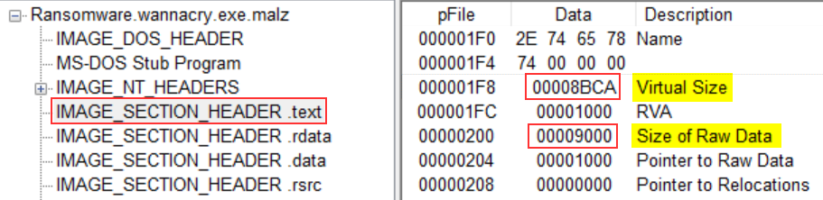

|                  | Size (in Hex) | Size (in Dec) |
| ---------------- | ------------- | ------------- |
| Virtual Size     | 00008BCA      | 35786         |
| Size of Raw Data | 00009000      | 36864         |
| Size Difference  | 00000436      | 1078          |

As you can see, the size difference is small. It means that both sizes are almost equal, resulting in the binary not being packed. But, it looks like there's more in this binary. 

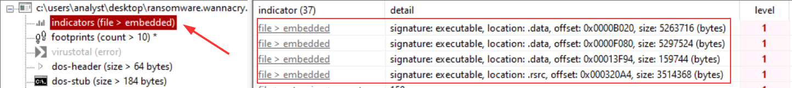

By looking at the `indicators` section in `PEStudio`, it tells me that "*The file contains another file*" and gives me the offset of where its located. Interesting. It could be worth taking a look at these further in the analysis.

---
#### What conditions are necessary to get this sample to detonate?

During the first detonation, I had `INetSim` running on my REMnux machine and quickly noticed that WannaCry would not detonate. However, when I turned off `INetSim`, it would run without any problems. What I thought was the following :

>Maybe WannaCry can detect INetSim by analysing the answer of the HTTP request ? But if it's the case, it means it can run without any internet connection as my FlareVM is isolated. So what's the point of detecting INetSim ?

In order to get more answers, I decided to open `Cutter` and statically analyze it. And I quickly found them in the `main` function :

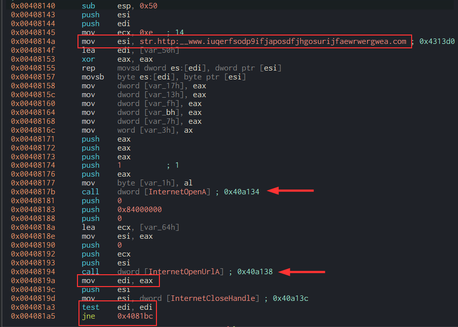

Here, you can see the URL I found earlier with `FLOSS`. It's first stored in `esi` and moved into `ecx` later on, according to the `lea ecx, [var_64h]` instruction. The function `InternetOpenA` is called after its arguments are being pushed onto the stack. It allows to initialize the use of the WinINet functions. Then, the same process is taking place for the `InternetOpenUrlA` function. Among the arguments, there's the killswitch URL. Indeed, this function opens a resource specified by a HTTP URL and therefore require an URL. 

The value returned by the `InternetOpenUrlA` function, stored in `eax`, is moved in `edi`. As it is stated in the [Microsoft documentation](https://learn.microsoft.com/en-us/windows/win32/api/wininet/nf-wininet-internetopenurla):

```
Returns a valid handle to the URL if the connection is successfully established, or NULL if the connection fails.
```

(Also, the `InternetCloseHandle` function is called in order to close the Internet handle).

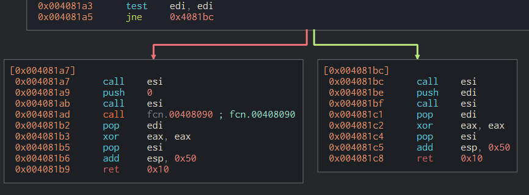

The value of `edi` is then evaluated through the instruction `test edi, edi`. The instruction `jne 0x4081bc` will determine if WannaCry will execute its payload or not. If you read my two previous articles, you must know that `jne` means `jump if not zero` and checks the value of the `ZF` register. 

If the value in `edi` **IS** `0` (i.e if the `ZF` register is equal to `1`),  WannaCry will take the left path and execute call its first function `fcn.00408090` to continue its execution. 

If the value in `edi` **IS NOT** `0` (i.e if the `ZF` register is equal to `0`), WannaCry won't execute any payloads and will exit.

Thanks to static analysis, I now know why having `INetSim` turned on wouldn't make WannaCry to detonate and I can confirm that the URL we found earlier is basically used as a killswitch for the malware. ^^ 


---
#### Network Indicators: Identify the network indicators of this malware

In order to identify network indicators associated to this malware, I first used `WireShark`.

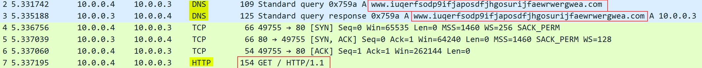

As I already showed previously, WannaCry has a killswitch URL to prevent its detonation under certain conditions. Here, you can clearly see its first trying to resolve the domain `www.iuqerfsodp9ifjaposdfjhgosurijfaewrwergwea.com`. If there's an answer to its DNS query, it will send an HTTP get request to `http://www.iuqerfsodp9ifjaposdfjhgosurijfaewrwergwea.com`, as we can see on the capture. Somehow, that's all I've been able to get with `Wireshark`.

So, in order to find morenetwork indicators, I also used `TCPView` as Wireshark wasn't showing me everything. 

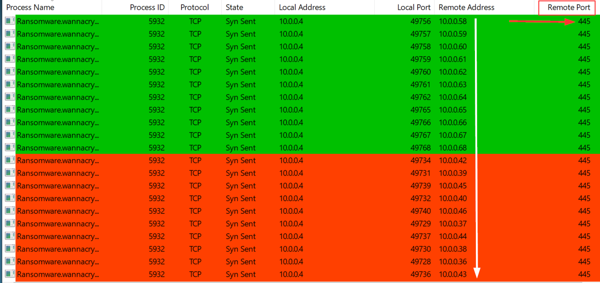

By filtering process name, I noticed that WannaCry was sending TCP Syn requests on port 445 to every IP address in the subnet my infected machine is (10.0.0.0/24). What the malware is trying to do is to infect other machines through the use of the SMB protocol, using the [EternalBlue - MS17-010](https://www.sentinelone.com/blog/eternalblue-nsa-developed-exploit-just-wont-die/) exploit developped by the NSA. I won't detail how the exploit is working as there's plenty of great article on the subject. But seeing this, I can affirm WannaCry is not only a **ransomware**, but also a **worm**.   

Removing the filter on process name made me realize there was another network indicator left out. 

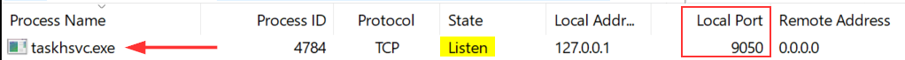

There's a binary called `taskhsvc.exe` listening on port `9050`. As far as I remember and confirmed by checking on [SpeedGuide](https://www.speedguide.net/port.php?port=9050), this port is used by Tor. I opened the process tree in `ProcMon` to check if it was launched with any specific arguments.

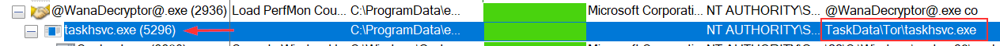

By looking at it, I saw that the binary was in a `\Tor\` directory. Interesting... So why not check manually in the directory where the binary was launched ?

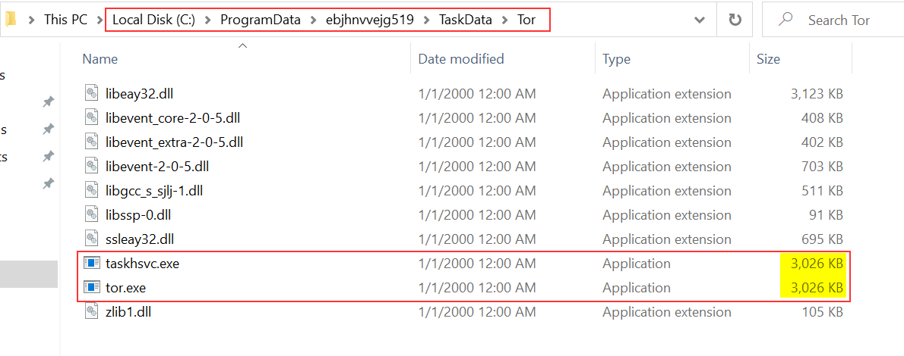

It's in `C:\ProgramData\ebjhnvvejg519\TaskData\Tor`. By looking into it, it seems that `taskhsvc.exe` is just a copy of `tor.exe`. I quickly checked if they had the same SHA256 hash value.

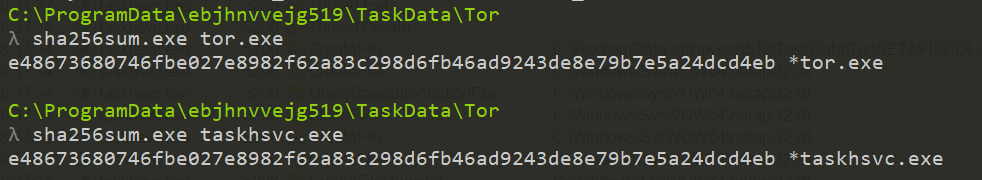

And indeed they have. The purpose of making a copy of `tor.exe` with that name is probably to hide itself and be less evident to spot. Still, I don't really know what's the purpose of launching Tor yet...

Now that I've found the network indicators of this malware, let's go through the host-based indicators !

---
#### Host-based Indicators: Identify the host-based indicators of this malware.

In order to identify host-based indicators, I only used `ProcMon`. I started to apply some filters :

- `Process Name` contains `Ransomware.wannacry.exe`
- `Operation` contains `CreateFile`

That way, I could quickly spot any files created by WannaCry.

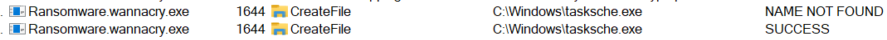

I found that `tasksche.exe` was created in the `C:\Windows\` directory.

Then, I modified my filters and decided to focus on `tasksche.exe` to see if it did anything interesting. Spoiler : it does...

- `Process Name` contains `tasksche.exe`
- `Operation` contains `CreateFile`

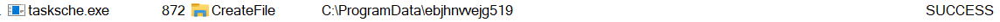

Among all of the operations, I found that it created the directory `ebjhnvvejg519` in `C:\ProgramData`. I decided to explore it manually and by looking at its properties, it's a hidden directory. Remember the command I found earlier that would modify a file / directory attribute to make it hidden ? It was meant for this !

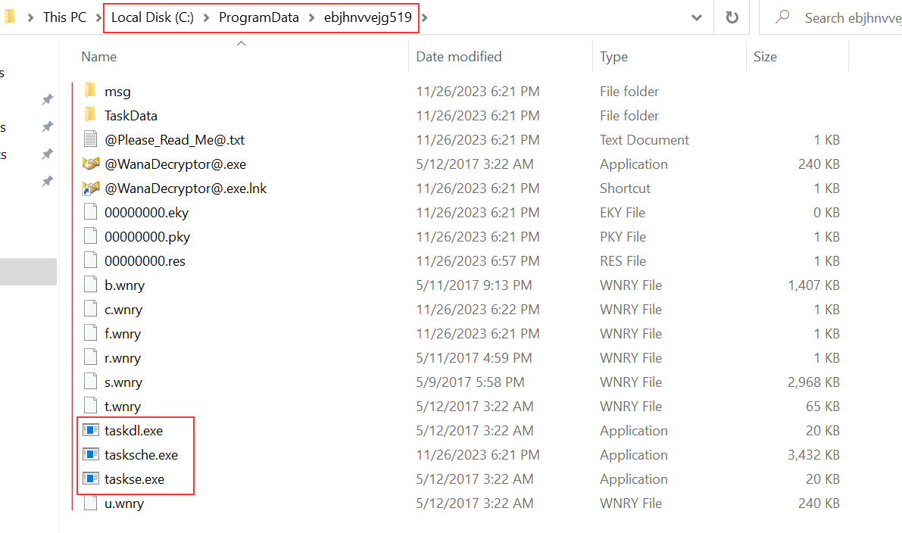

At first sight, it looks like this custom directory is used to unpack WannaCry ressources. I notice three two new binaries : `taskse.exe` and `taskdl.exe`. 

I also noted that the creation of a service occured. By opening the `Task Manager`, I could confirm it.

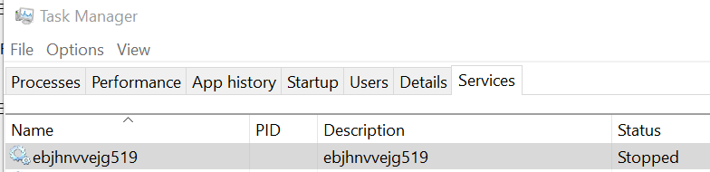
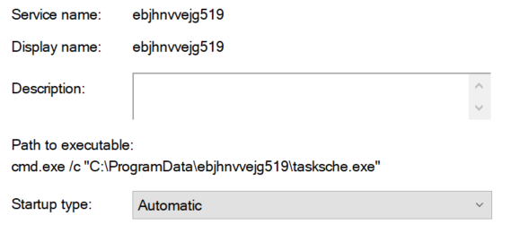

A service has been created with the exact same name as the directory (`ebjhnvvejg519`) and the path to executable is `C:\ProgramData\ebjhnvvejg519`. What I suppose is that its purpose is to continuously encrypt files on the machine. Everytime the computer will boot or reboot, it'll start and do its encryption job. That's a mechanism of persistence. Indeed, it looks like `tasksche.exe` is also responsible of encrypting the files as you can see on the screenshot below with two files of mine : `cosmo.jpeg` and `output-floss.txt`.

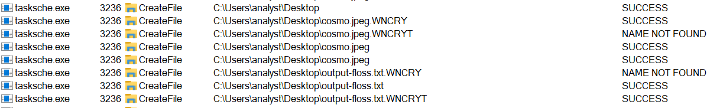

That conclude the question on host-based indicators.

---
#### Use Cutter to locate the killswitch mechanism in the decompiled code and explain how it functions.

Woops, it looks like I already answered that in the question "`What conditions are necessary to get this sample to detonate?`". (:

---

## YARA Rule

```yara
rule WannaCry {
   meta:
      description = "YARA Rule for WannaCry detection"
      author = "hashp4 (and inspired by Florian Roth)"
      date = "2023-11-27"
      hash = "24d004a104d4d54034dbcffc2a4b19a11f39008a575aa614ea04703480b1022c"
   strings:
      $string1 = "icacls . /grant Everyone:F /T /C /Q" fullword ascii
      $string2 = "tasksche.exe" fullword ascii
      $string3 = "attrib +h ." fullword ascii
      $string5 = "WNcry@2ol7" fullword ascii
      $string6 = "www.iuqerfsodp9ifjaposdfjhgosurijfaewrwergwea.com" ascii
      $string8 = "C:\\%s\\qeriuwjhrf" fullword ascii

      $unc1 = "\\\\192.168.56.20\\IPC$" fullword wide
      $unc2 = "\\\\172.16.99.5\\IPC$" fullword wide
   condition:
      ( 1 of ($string*) and 1 of ($unc*) ) and filesize < 10000KB
}
```

---

## Conclusion

For this course, that was the last question. But I'm really interested in how WannaCry is working and I want to explore deeper into this malware. So, this blog post will have a second part to add bonus explanation by answering more questions such as:

- What is the purpose of the other embedded binaries (Tor included 🤗)?
- How does WannaCry unpack its resources?
- How does the encryption mechanism works and takes place?
- Is it possible to decrypt the files even if we don't pay the ransom?

I hope you enjoyed this blog post and that it could help understand how WannaCry is acting. Do not hesitate to reach me out if you have any questions or if I made any mistakes in defining concepts or using technical terms. I'm still a newbie to this domain and I'd be happy to have feedbacks from more experienced analysts. 💜

*PS: In a couple of days or weeks, I'll probably start the exam and try to be PJMR* (**Practical Junior Malware Researcher**) *certified. In the meantime, I will train on different malware samples so I won't be able to go back on WannaCry for some time. ^_~*

Thanks for reading me and see you soon ! 👋
