# Xintra APT Emulation Lab - Waifu University ♡ (＞ω＜)


## Context

Waifu University's cyber team has called us after their IT teams reported a number of servers with files that aren't opening and have a strange extension.

On the scoping call, the victim also said they had identified a ransom note stating their data has been stolen. When asked about any earlier signs, the victim mentioned some strange, failed login activity early in March 2024 in their Entra ID, but wasn't of concern at the time...

Ransomware will typically avoid system files to not cause crashes in the system, which also happens to be where a lot of forensic evidence is! We have been provided triage images of the hosts and log exports from the relevant systems.

We are also given the network diagram of the infected part of the Waifu University network that the client is concerned with.

<br>

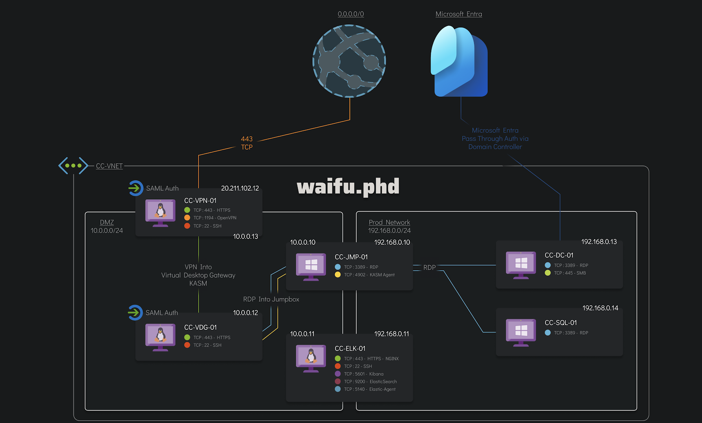

<br>

---

## Chain of Events

The attack on `Waifu University` by `AlphV/BlackCat` consisted of **four** main phases: 

<br>

**Phase 1: Initial Access and Foothold** (*03/03/2024*). 

The threat actor initiated the attack by first compromising the Azure account of an internal employee through bruteforce and MFA push fatigue attacks, gaining access to the VPN and being able to breach into a jumpbox server in `Waifu University`’s network as a pivot point from which to launch the attack.

<br>

**Phase 2: Lateral Movement** (*03/03/2024*). 

The threat actor used several privilege escalations techniques and the Cobalt Strike platform to move laterally between the victim’s on-premises hosts and Azure environment through VPN and RDP connections.

<br>

**Phase 3: Data Exfiltration** **and Additional Lateral Movement** (*05/03/2024 - 07/03/2024*). 

The threat actor managed to gain access to both the Domain Controller and the SQL server, allowing the exfiltration of a sensitive informations.

<br>

**Phase 4: Extortion Attempts** (*07/03/2024*). 

The threat actor detonated their ransomware and probably threatened `Waifu University` to publish sensitive information if the ransom was not paid. They might have exaggerated about the volume and sensitivity of the stolen information.

<br>

*(this formatting of the chain of events was greatly inspired by Sygnia during their own analysis of [the anatomy of a BlackCat (ALPHV) attack](https://www.sygnia.co/blog/blackcat-ransomware/) which is awesome and worth checking :D)*

---

## Phase 1: Initial Access and Foothold (03/03/2024)

### 1.1. Scoping the incident

This investigation started by having a look at the current state of the different machines in order to scope the incident. We quickly notice that every encrypted file has the extension `.kh1ftzx` appended to them. Moreover, we could also see the ransom note called `RECOVER-kh1ftzx-FILES.txt` in several directories. 

<br>

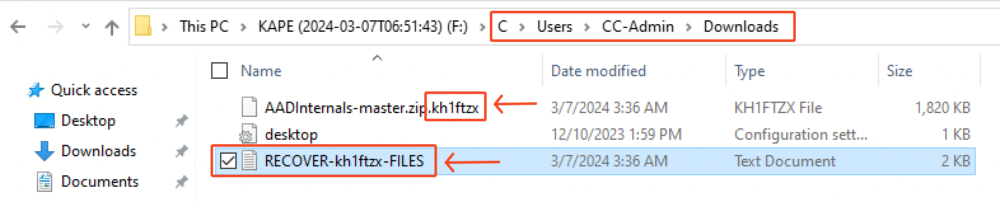

<br>

Inside this ransomware note, there's a bunch of informations on what happened, what was supposedly stolen from Waifu University and the instructions on how to pay the ransom. For further communication, we're left with the following TOR URL: `rfosusl6qdm4zhoqbqnjxaloprld2qz35u77h4aap46rhwkouejsooqd.onion`

<br>

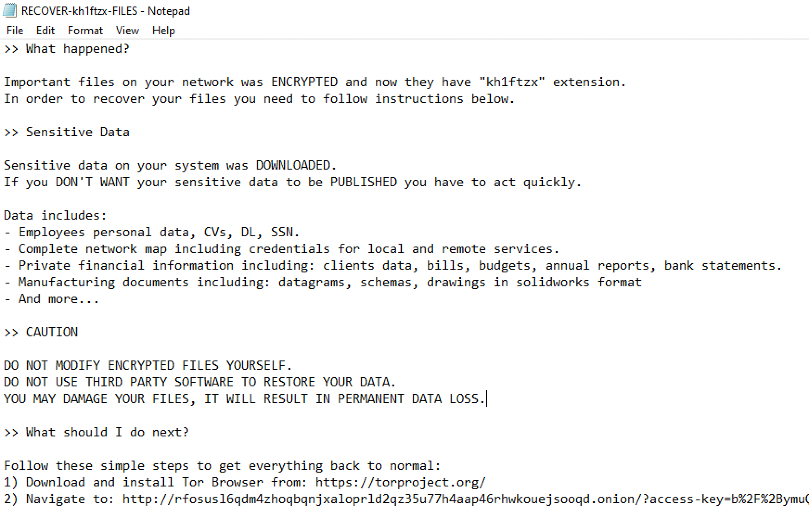

<br>

### 1.2. Initial access via EntraID

There was several failed login attempts on the `identity provider` of **Waifu's university**, which is `Microsoft EntraID` (the new name for *Microsoft Azure Active Directory*). This is something we can notice by filtering for the `azure.activitylogs.result_type` field with the value of `50126`. 

<br>

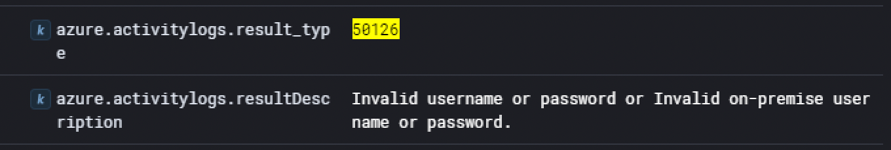

<br>

This "event ID" is related to **Azure AD sign-in logs** which capture informations about user sign-in activities within the Azure AD environment. In this case, the description displayed shows some kind of bruteforce activity. 

<br>

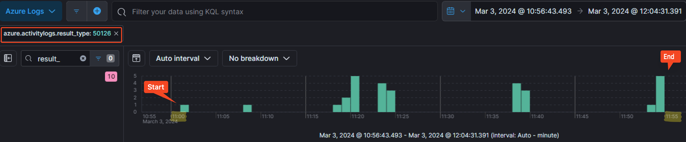

<br>

As the we can see on the timeline, those failed login attempts started on the `3rd of March 2024` at around `11:01:11 AM` and finished at `11:54:58 AM`. 


<br>

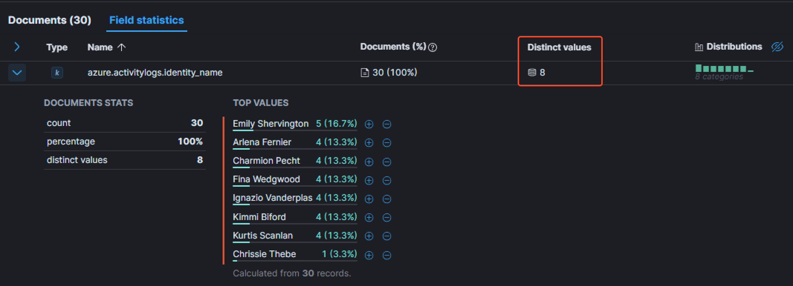

<br>

By adding the field `azure.activitylogs.identity_name` as a column, we can see the number of unique users that were targeted by the login attempts. The `Field statistics` tab show that the attacker attempted to authenticate with a total of `8` users. 


<br>

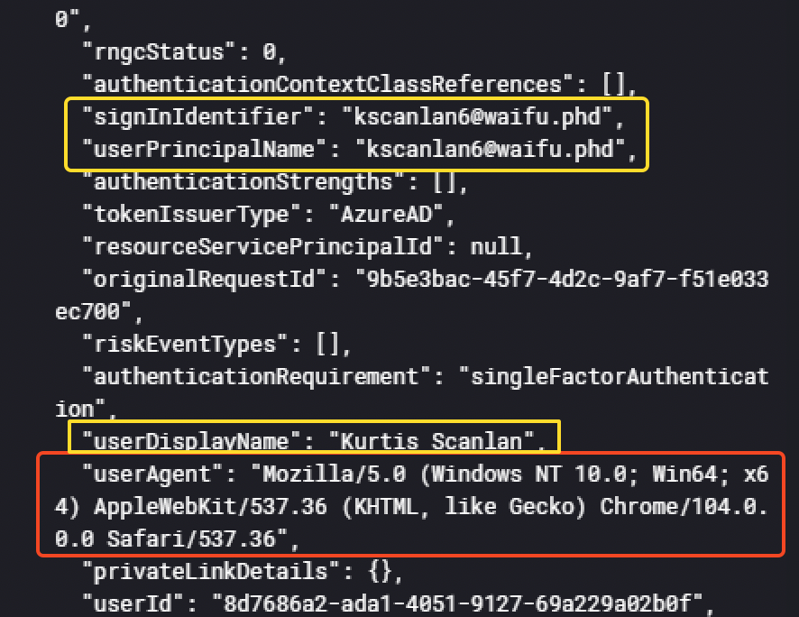

<br>

In the event details, we have some interesting informations such as the user agent used by the threat actor.

<br>

```
Mozilla/5.0 (Windows NT 10.0; Win64; x64) AppleWebKit/537.36 (KHTML, like Gecko) Chrome/104.0.0.0 Safari/537.36
```

<br>

We also notice from which IP the threat actor was conducting his attack.

<br>

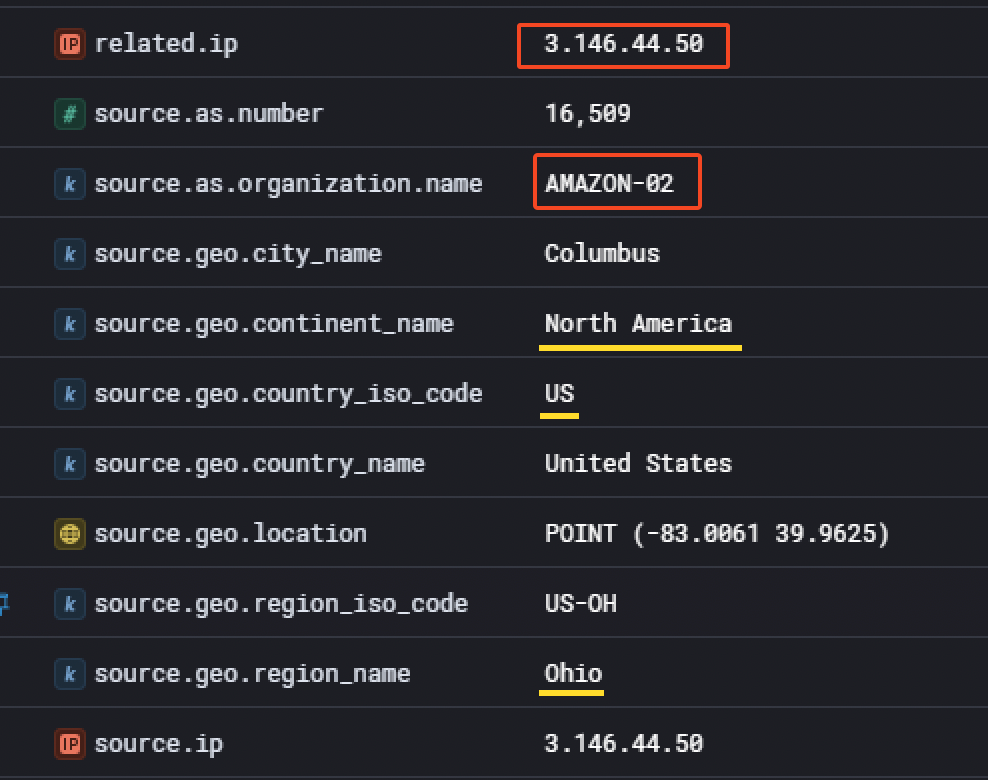

<br>

It appears he used a cloud provider (`AWS`) to proxy his requests. Although the information was available in the event details, it is not a bad idea to double check on VirusTotal.

<br>

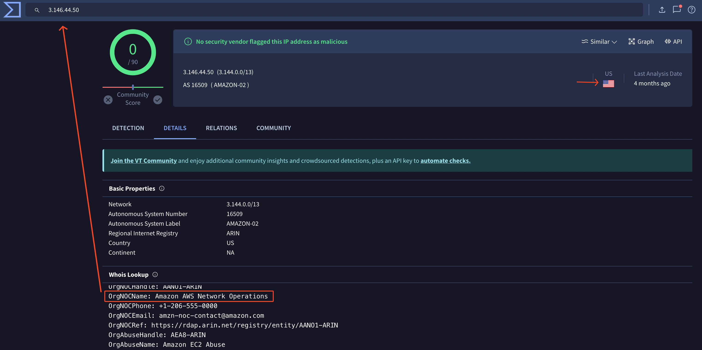

<br>

That said, the information held in this event was limited and it's hard to see if the threat actor managed to succesfully login. What can be done is temporary disabling the `azure.activitylogs.result_type` filter while adding the field `azure.activitylogs.identity_name` equal to `exists` to remove noisy events that are not related to this activity. Also, something useful is adding the field `azure.activitylogs.resultDescription` as a column to quickly notice a different behavior

<br>

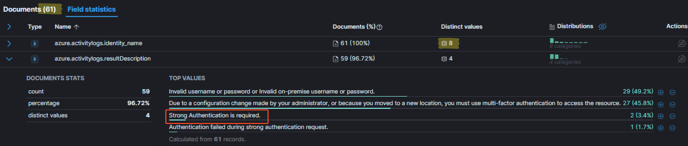

<br>

As you may see, for the same number of user, we have a few more events. By looking at the distinct descriptions, one that caught my eye: `Strong Authentication is required`. For me, it meant the primary authentication was successful (`username:password` couple), but that additional authentication was required (such as `MFA`). Adding this value as a filter is a good idea to see for which user those events occured. 

<br>

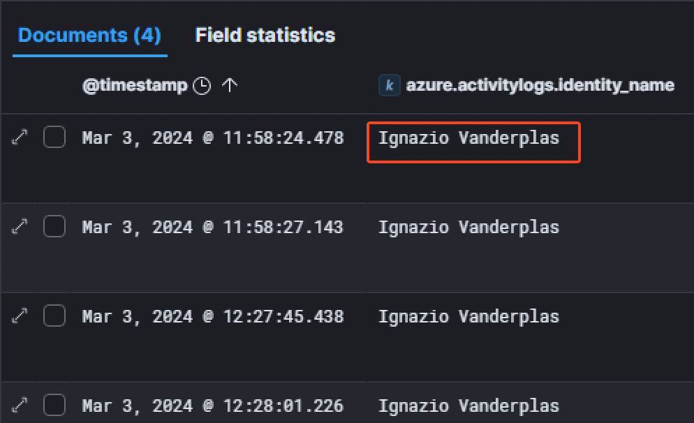

<br>

The only user concerned was `Ignazio Vanderplas`. 
Furthermore, we can see more interesting informations in the event details related to the user and the authentication. 

<br>

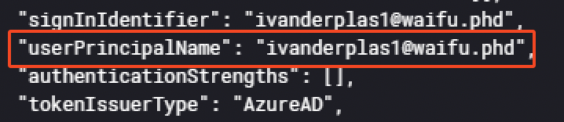

<br>

For example, the `userPrincipalName` (UPN) is available. Here, the value for the user is `ivanderplas1@waifu.phd`.


<br>

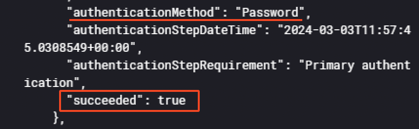

<br>

Also, it appears the `"authenticationMethod": "Password"` succeeded, demonstrating the threat actor successfully logged into the account but was locked by the MFA. But he still  managed to authenticate, even if MFA was setup. Indeed, he used a technique called `MFA push fatigue`.

<br>

> *A multi-factor authentication (MFA) fatigue attack – also known as MFA Bombing or MFA Spamming – is a social engineering cyberattack strategy where attackers repeatedly push second-factor authentication requests to the target victim’s email, phone, or registered devices. The goal is to coerce the victim into confirming their identity via notification, thus authenticating the attackers attempt at entering their account or device.*
> Source: [BeyondTrust](https://www.beyondtrust.com/resources/glossary/mfa-fatigue-attack)

<br>

To find this information, increasing the timespan by 2 hours and filtering with the `azure.activitylogs.identity_name` of `Ignazio Vanderplas` is a great way. Then, same method as before, by looking at the distinct `resultDescription` messages to see if there was any interesting one. One was more present than the others:

<br>

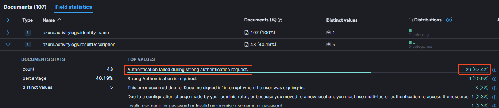

<br>

The message `Authentication failed during strong authentication request` is way more present than the others for this particular user. Having a look at the event details:

<br>

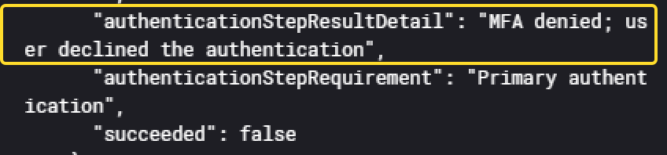

<br>

It shows the MFA was denied by the user, meaning that each of this event sent a MFA push notification to the user. In total, he received atleast 29 of them, and in a very short timespan, matching the definition of the MFA push fatigue.

<br>

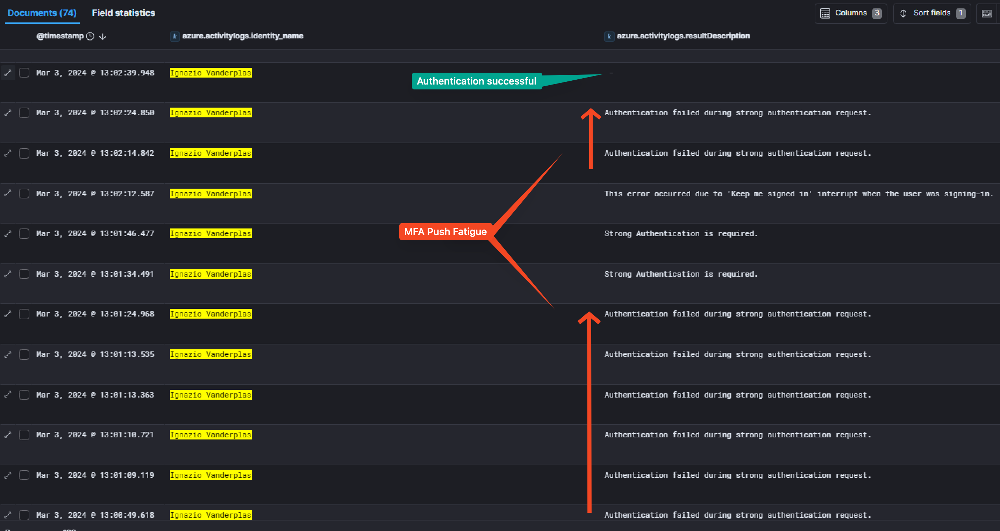

<br>

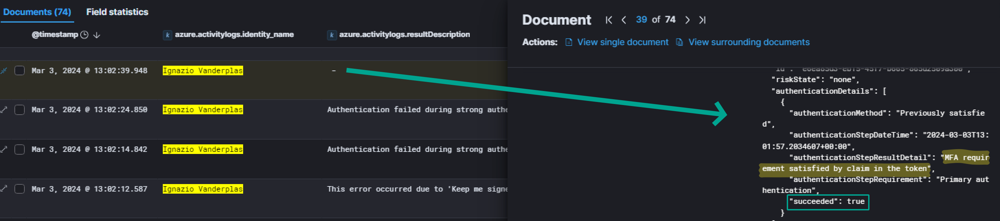

<br>

Inside this same event, we also have a field displaying the IP that was used to successfully logging into the environment:

<br>

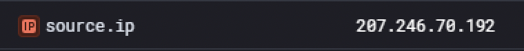

<br>

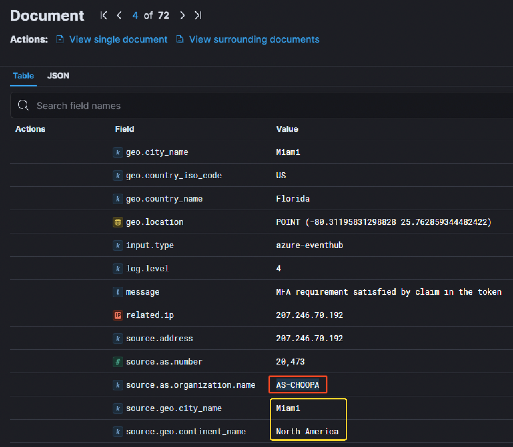

<br>

We have also have more details about it. The IP corresponds to a server located in Miami in the United States and belongs to AS-CHOOPA. Investigating this IP with Shodan gave us more details. [Shodan Result](https://beta.shodan.io/host/207.246.70.192#22)

<br>

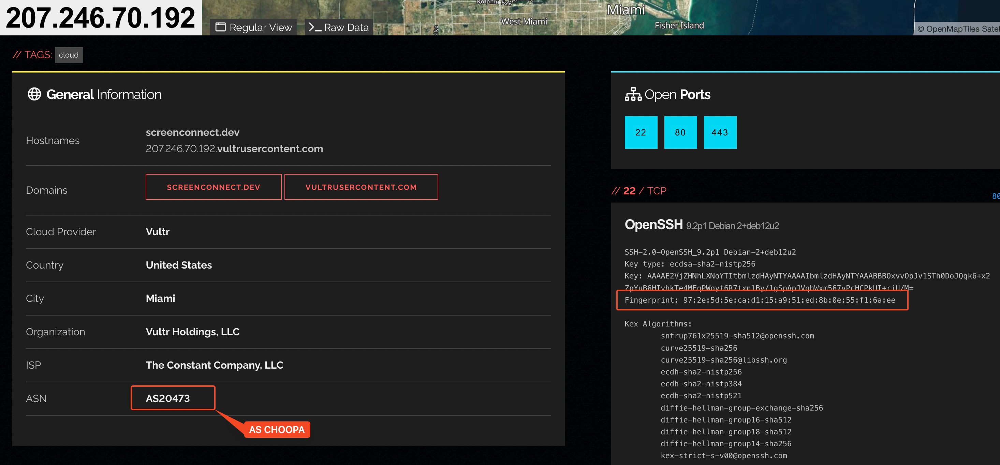

<br>

We can see the server has different open ports
- SSH (22)
- HTTP & HTTPS (80, 443)

Thanks to the SSH information grabbed by Shodan, we even managed to retrieve the SSH fingerprint for the IP address.

```
97:2e:5d:5e:ca:d1:15:a9:51:ed:8b:0e:55:f1:6a:ee
```

<br>

### 1.3. Breaching the university

After knowing the threat actor successfully managed to connect to the VPN through the account `ivanderplas1@waifu.phd`, the next step was to find the breached host, which is the hostname the attacker was able to first access once in the network.

Since the threat actor logged into `OpenVPN`, it is interesting to look for logins from the DMZ. Here are the filters that can be used to find the information:

- Windows Event Log ID `4624` corresponding to `An account was succesfully logged on`, 
- the username of the breached account `Ignazio Vanderplas`with the filter `winlog.event_data.TargetUserName` equal to `ivanderplas1`,
- the `CC-VDG-01` host's IP address (`10.0.0.12`) which is the Virtual Desktop Gateway. 

<br>

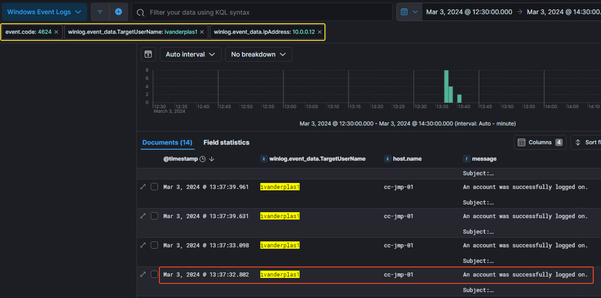

<br>

We can notice the first successfull connection was made at `13:37:32 PM` the `3rd of March 2024` on the host called `CC-JMP-01` corresponding to the jumpbox host.

<br>

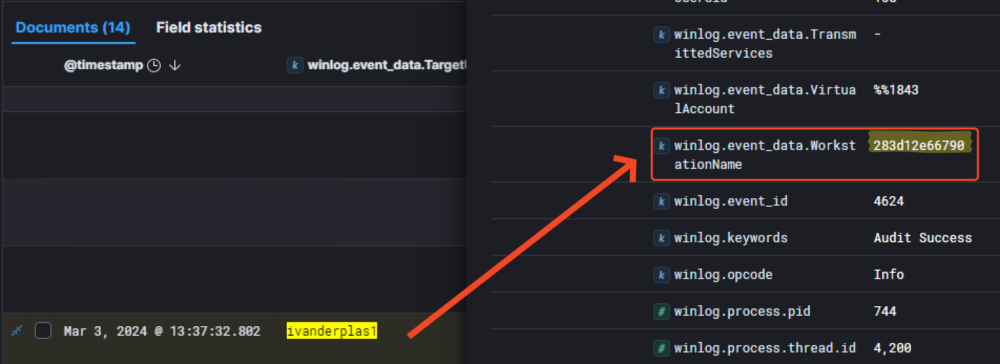

<br>

Another interesting information is the field `winlog.event_data.WorkstationName` which is related to the hostname of the threat actor's device used to get into the network.

After knowing the attacker accessed the `CC-JMP-01` host, we investigated its dump. An interesting thing to look out for is the browser history which is located in `C:\Users\ivanderplas1\AppData\Local\Microsoft\Edge\User Data\Default\History`

<br>

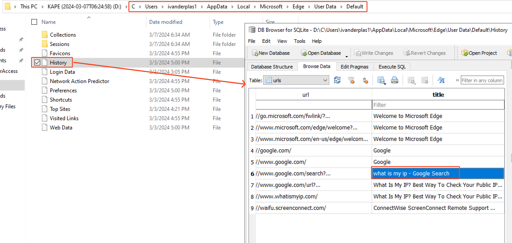

<br>

We can see he searched for `what is my ip`. anf that's pretty much it. But another interesting thing to look out for is which commands has been executed by the attacker. It's worth investigating the Powershell command line history file located at `C\Users\ivanderplas1\AppData\Roaming\Microsoft\Windows\PowerShell\PSReadline` 

<br>

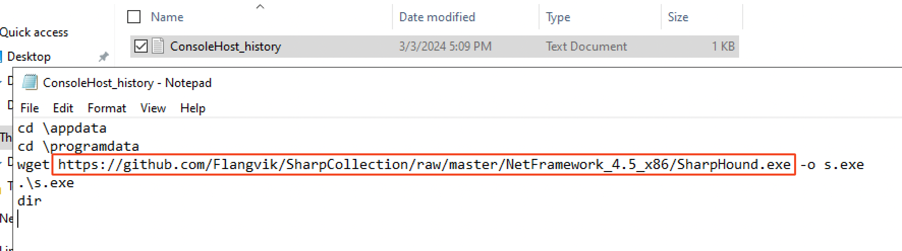

<br>

The attacker downloaded `SharpHound.exe` as `s.exe` on the host directly from Github, in the following repo: `https://github.com/Flangvik/SharpCollection` and executed it with the command `.\s.exe`.  Surely, this allowed him to enumerate the network in order to find privilege escalation and lateral movements vectors.

<br>

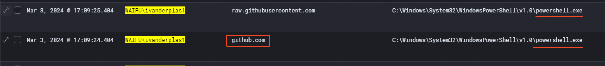

<br>

Additionally, we can see that in Windows Event with an `event.code`of `22` corresponding to `DNS query`. Here's the proof that a Powershell process has been spawned to make a DNS query to `github.com` at `17:09:24 PM` on the same day. 

<br>

### 1.4. Privilege Escalation

After thorough analysis, we were able to identify the threat actor was querying service information on the beachhead host about an hour after the previous event. Shortly after they seemed to have administrator access.

<br>

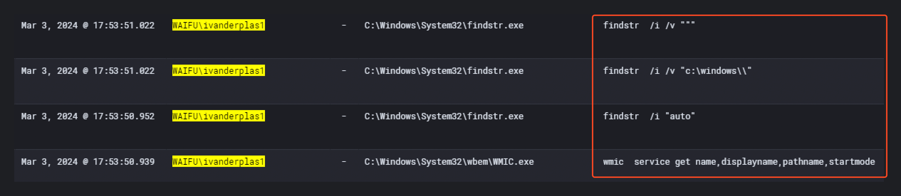

<br>

At `17:53:50 PM`, the attacker executed several commands for enumeration purposes in order to find a privilege escalation vector. 

<br>

```
wmic service get name,displayname,pathname,startmode
findstr /i "auto"
findstr /i /v "c:\windows\\"
findstr /i /v """
```

<br>

Those commands are used to find `Unquoted Service Paths`. On the `MITRE ATT&CK` website, we can find it is corresponding to the sub-technique ["T1574.009 - Path Interception by Unquoted Path"](https://attack.mitre.org/techniques/T1574/009/) which is commonly used for privilege escalation.

By doing some research, we can find the exact same commands in this [pentest cheatsheet](https://github.com/pha5matis/Pentesting-Guide/blob/master/privilege_escalation_windows.md) on Github. 

<br>

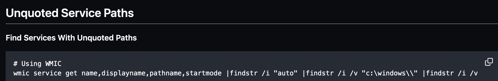

<br>

A few minutes after, at `18:15:18 PM`, the attacker created a file called `waifu.exe` 
(`SHA1: dc202a87712c20412ab292fb0b868cff97b68db3` ).

<br>

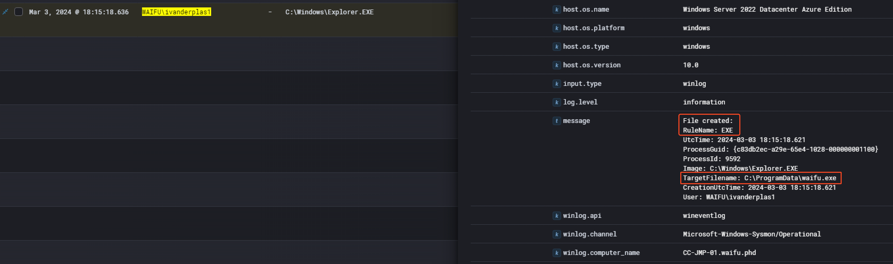

<br>

<br>

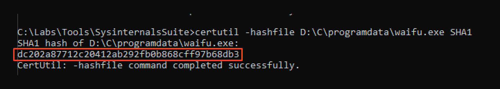

<br>

Then, one minute later at `18:16:21 PM`, the threat actor started the service `Waifu Service`. 

<br>

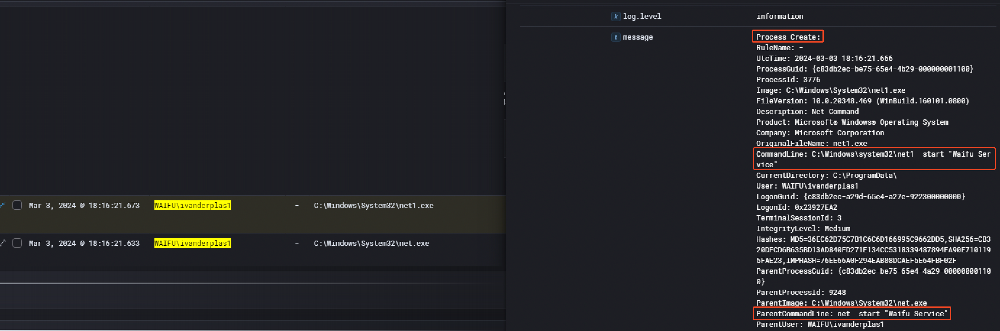

<br>

The `Waifu Service` is directly linked to the `waifu.exe` binary created previously. Searching for the hash of the binary had no results on VirusTotal. 

<br>

---

## Phase 2: Lateral Movement (03/03/2024)

### 2.1. Remote Access

Once the threat actor managed to escalate his privileges as `NT AUTHORITY\SYSTEM`, he installed `ScreenConnect` at `18:21:26 PM`. We can see that by keeping the same timeline and filtering with `winlog.event_data.User` equal to `NT AUTHORITY\SYSTEM`. 

<br>

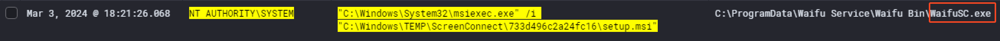

<br>

When we take a closer look at the command that has been executed, we can see that `ScreenConnect` will communicate with the host `instance-i77ws2-relay.screenconnect.com`

<br>

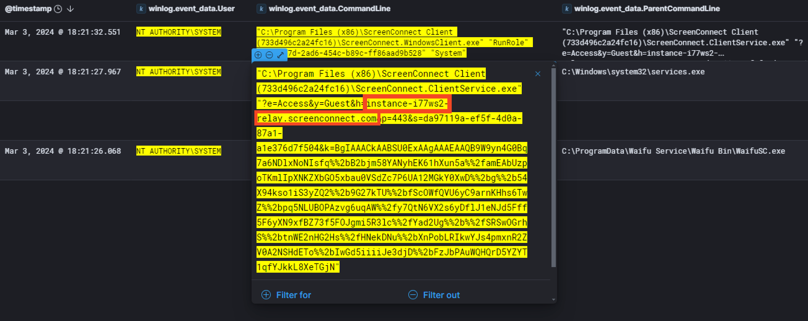

<br>

The threat actor then ran an interesting payload. He replaced the legitimate `C\Program Files\Python312\python.exe` with some kind of malware with the help of the `ScreenConnect File Manager`. As far as we know from the events we have, the binary was still legitimate on the 4th of March 2024 at `13:09:17 PM`. The next day, 5th of March 2024 at `23:25:24 PM`, the malicious `python.exe` was there. We confirmed that with the hash of `python.exe` that changed.

<br>

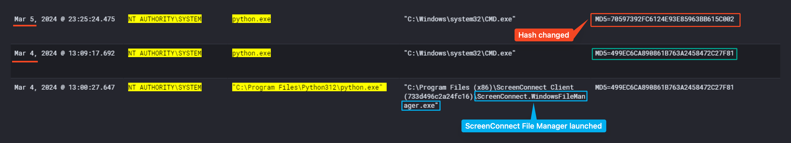

<br>

Sadly, the sysmon event logs didn't record any network activity due to the limitation of the configuration setup by `Waifu University`. Still, we managed to get the process dump from them for further analysis. 

By looking at the process dump, we find it was a Cobalt Strike beacon. By using the tool `Cobalt Strike Configuration Extractor and Parser`, we manage to extract the IP the beacon talks to.

<br>

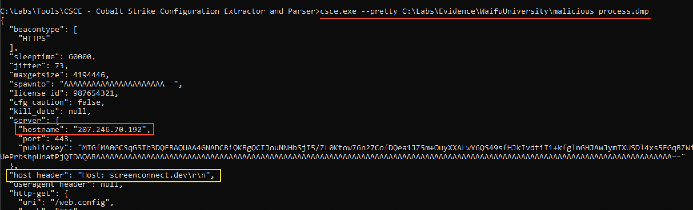

<br>

As you can see on the above, the hostname IP address is `207.246.70.192`. Another interesting information we retrieve is the domain in the `host_header` which is `screenconnect.dev`.

<br>

---

## Phase 3: Data Exfiltration and Additional Lateral Movement (05/03/2024 - 07/03/2024)

### 3.1. Accessing Volume Shadow Copies

In the meantime, the threat actor managed to access a volume shadow copy of the beachhead host. Indeed, at `21:23:17 PM` on the 5th of March, they ran the command `vssadmin create shadow /for=C:` to create a new volume shadow copy of the C drive of `CC-JMP-01`. They did this in order to pull local password hashes. 

> *There are a few ways to dump Active Directory and local password hashes. Until recently, the techniques I had seen used to get the hashes either relied on injecting code in to LSASS or using the Volume Shadow Copy service to obtain copies of the files which contain the hashes.* 
> Source : [SpiderLabs Blog](https://web.archive.org/web/20131126032842/http://blog.spiderlabs.com/2013/11/tutorial-for-ntds-goodness-vssadmin-wmis-ntdsdit-system-.html)


<br>

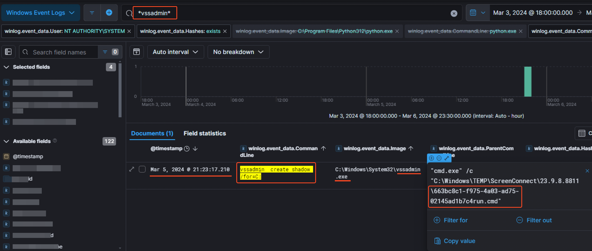

<br>

We can also notice the file `663bc8c1-f975-4a03-ad75-02145ad1b7c4run.cmd` which was responsible for running the volume shadow copy command. 

### 3.2. Looking around the network

A few minutes later at `21:39:40 PM`, the threat actor managed to open a file that was supposed to be in a hidden share from the beachhead host. We managed to saw that by filtering for `event.code` equal to `5140` corresponding to `A network share object was accessed`. Then checking unique distinct entries, we noticed the following share: `SuperSecretSecureShare`.

<br>

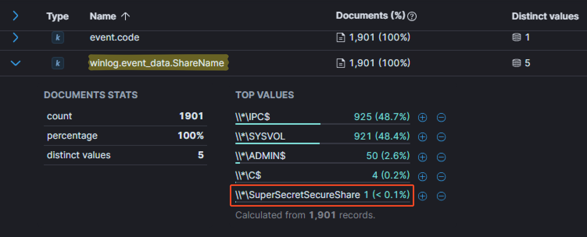

<br>

At this point, we then just filtered for `winlog.event_Data.ShareName` equal to `\\*\SuperSecretSecureShare` and added the field `winlog.event_data.RelativeTargetName` as a column to find any file accessed. The attacker first accessed the file `you-cant-see-this-cause-I-am-good-at-NTFS-permissions.txt`, still at `21:39:40 PM`. 

<br>

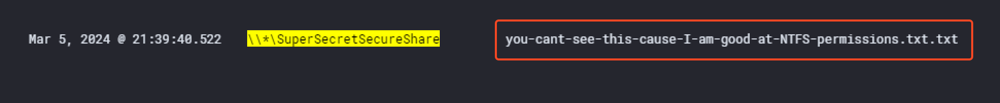

<br>

This information could also be found in the output CSV file of the LECmd tool from Eric Zimmerman which is a LNK Explorer. 

<br>

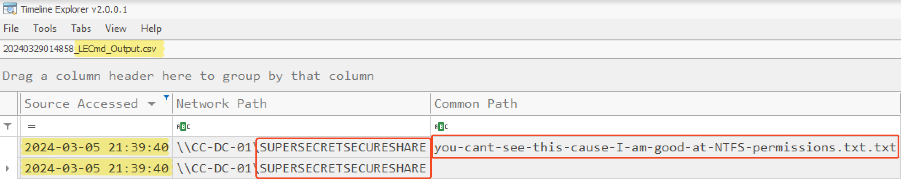

<br>

Back to the Cobalt Strike beacon, we wanted to take a closer look at what has been initiated by it. To do so, a good option was to make an OR syntax filtering for `C:\Prgram Files\Python321\python.exe` as a `ProcessName` or as an `Image` from the creation of the beacon. There was around 15 events found with this method.

<br>


<br>

At `02:05:13 AM` on the 6th of March 2024, the threat actor enumerated the `Builtin\Administrators` group.

<br>

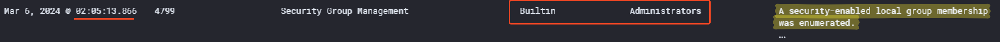

<br>

Then, they managed to create the file `SharpHound.exe` at `02:18:41 AM`. 

<br>

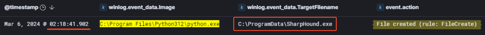

<br>

The same information could be found in the parsed `$MFT` with a little bit more of efforts.

<br>

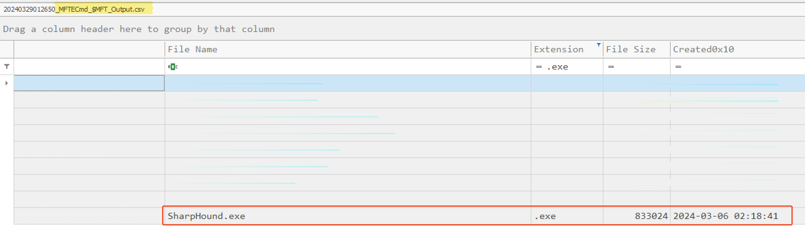

<br>

That said, they didn't manage to execute this tool. Indeed, after filtering for `event.code` equal to `4688` to find `created processes`, there was no result for the `SharpHound.exe`binary. As there was no evidence of execution, we can assume the threat actor didn't execute the tool succesfully. 

### 3.3. Domain dominance

A few minutes later at `02:13:16 AM` on the 6th of March 2024, the threat actor attempted to install a service called `8628f7b` on the Domain Controller, linked to the `8628f7b.exe` binary. 

<br>

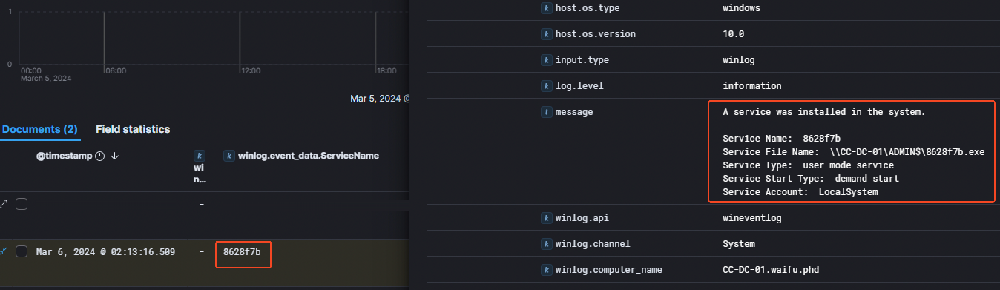

<br>

Then at `02:22:02 AM` and `02:22:51 AM`, the attacker logged in with the account `CC-Admin` on the Domain Controller `CC-DC-01`. An interesting information we could find investigating those logs was the operating system distribution the threat actor is using: [Parrot](https://parrotsec.org/), a famous OS for security professionnals like `Kali Linux`. The information was found in 2 different events IDs : 
- 4776 -> The computer attempted to validate the credentials for an account
- 4624 -> An account was successfully logged on.

<br>

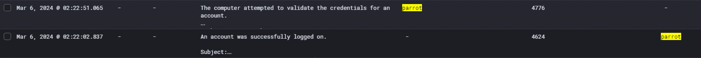

<br>

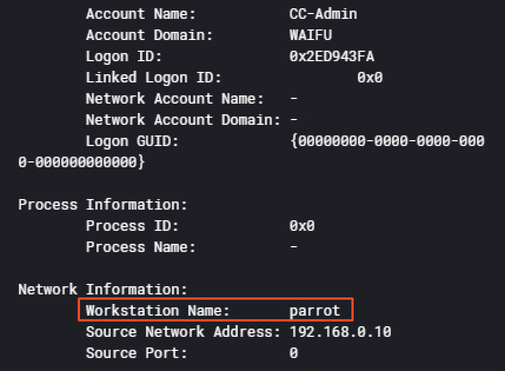

<br>

Around 30 minutes later at`02:53:15 AM`, the user `CC-Admin` ran the `InjectDLL.exe` binary from the `AADInternals` toolkit in order to inject the dll `PTASpy.dll`into a process with a PID of `3616`. 

<br>

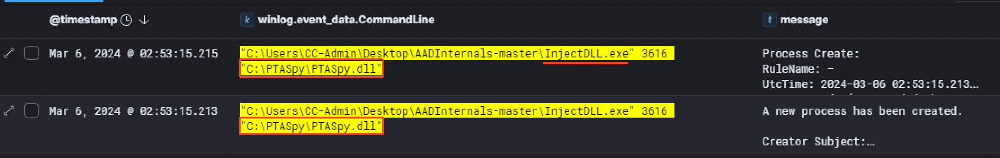

<br>

Having the PID of the process injected into, we pivoted with that information to see which process had this PID before the injection. Something worth noting is we had to also filter for the hexadecimal equivalent of the PID (`3616` in *base 10* is equal to `0xe20` in *base 16*). It appeared the file name of that process was `AzureADConnectAuthenticationAgentService.exe`

<br>

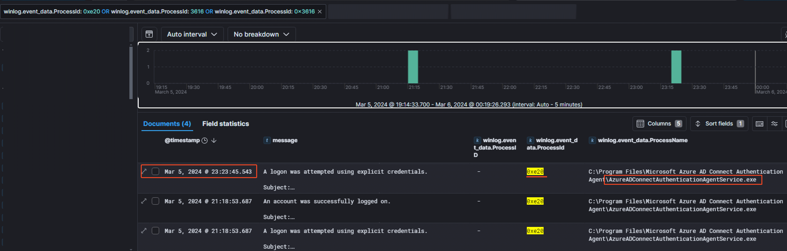

<br>

And it makes sense because while investigating for `PTASpy`, I stumbled across the [PTASpy.ps1](https://github.com/Gerenios/AADInternals/blob/master/PTASpy.ps1)script on Github. By looking at it, we quickly noticed that PTASpy **collects credentials** and **needs to be run on a computer with Azure AD Authentication Agent running**, hence why it was injected in this process. 

<br>

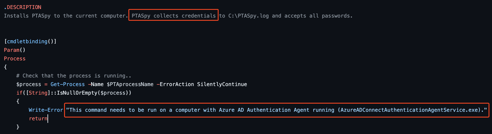

<br>

Looking at the users present on `CC-DC-01`, we can assume that the credentials of the user `cpecht7` could have get their credentials stolen by the DLL.

<br>

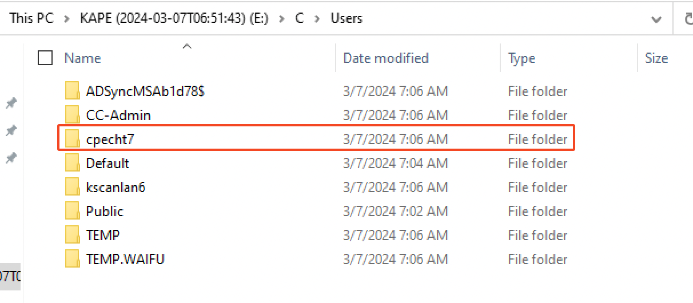

<br>

### 3.4 Accessing the good stuff

Looking at the RDP connections that succeeded through the event code `1149`, we noticed the threat actor moved on the  SQL server`CC-SQL-01` at `02:59:30 AM` on the 6th of March 2024 with the user `cc-admin`. 

<br>

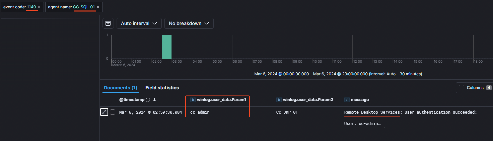

<br>

We had the information that the University admins noticed a strange file in the documents folder of the admin user for the SQL server which was created during the intrusion. So we started by searching for a suspicious file in the `Documents` folder of the `CC-Admin` user in the parsed `$MFT` CSV file and noticed a file called `database.bak.rpt.kh1ftzx`.

<br>

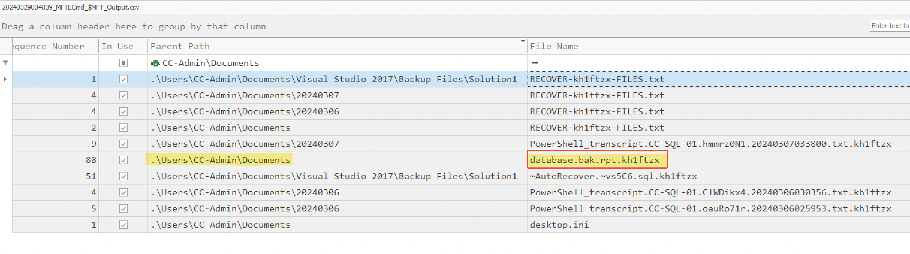

<br>

To see the earliest MFT Entry of this file and track any change made to it, we then used the `USNJrnl`.  So, we opened `$J` (a parse file) and noticed its first MFT Entry ID was at `03:09:24 AM` on the 7th of March 2023. Also, it's worth mentioning that `.rpt` is one of the export types you can choose from Microsoft SQL Server.

<br>

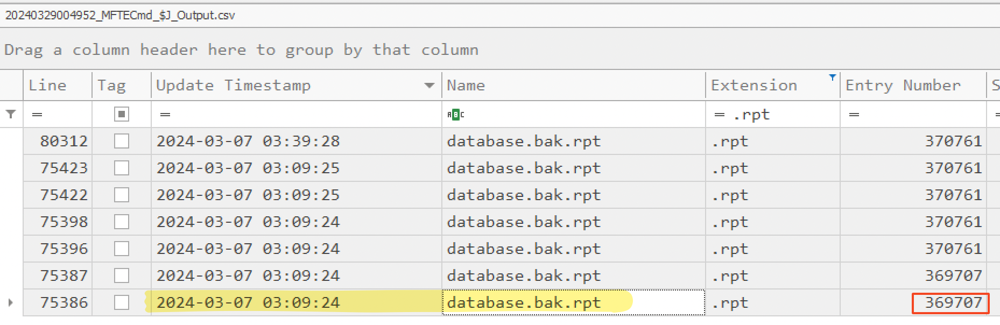

<br>

We can assume the threat actor probably exfiltrated the data from the SQL server before releasing the ransomware. 

<br>

---

## Phase 4: Extortion Attempts (07/03/2024)

### 4.1 Release the ransomware UwU

Finally, at `03:33:36 AM` on the 7th of March 2024, we observed the execution of the ransomware named `print64.exe`. First, `print64.bat` get executed and will run the malware with the access token as an argument.

<br>

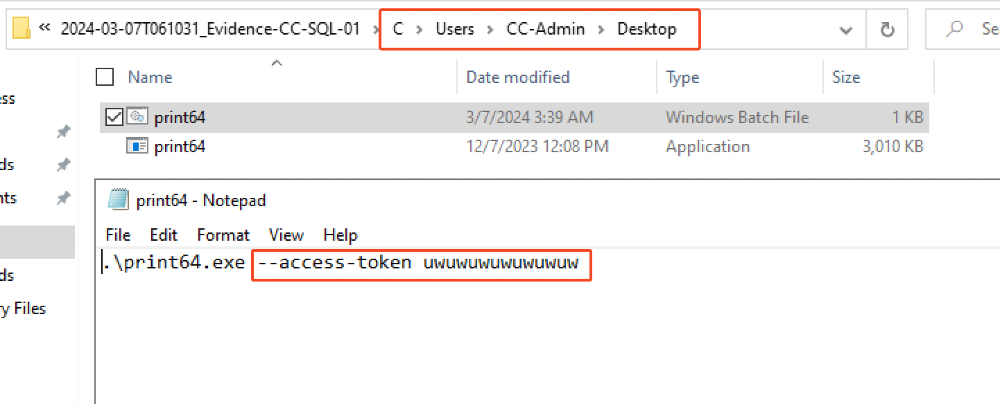

<br>


<br>

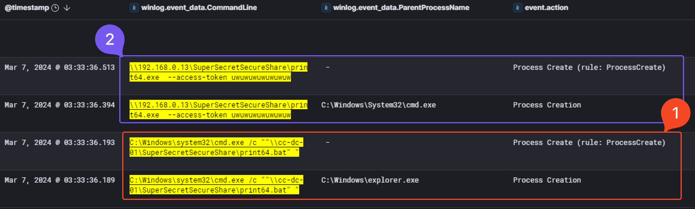

<br>

Then, a bunch of commands got executed and files were encrypted. You'll find below the command executed and their description, also reported by [Microsoft](https://www.microsoft.com/en-us/security/blog/2022/06/13/the-many-lives-of-blackcat-ransomware/) 

<br>

| Command                                                                                                                     | Description                                                                                                                                                                                                                                                                |
| --------------------------------------------------------------------------------------------------------------------------- | -------------------------------------------------------------------------------------------------------------------------------------------------------------------------------------------------------------------------------------------------------------------------- |
| `wmic csproduct get UUID`                                                                                                   | Gets the Universally Unique Identifier (UUID) of the target device                                                                                                                                                                                                         |
| `wmic.exe Shadowcopy Delete`                                                                                                | Deletes shadow copies                                                                                                                                                                                                                                                      |
| `fsutil behavior set SymlinkEvaluation R2L:1`                                                                               | Allows remote-to-local symbolic links; a [symbolic link](https://docs.microsoft.com/windows/win32/fileio/symbolic-links) is a file-system object (for example, a file or folder) that points to another file system object, like a shortcut in many ways but more powerful |
| `fsutil behavior set SymlinkEvaluation R2R:1`                                                                               | Allows remote-to-remote symbolic links                                                                                                                                                                                                                                     |
| `iisreset.exe /stop`                                                                                                        | Stops running services to allow encryption of data                                                                                                                                                                                                                         |
| `reg add HKEY_LOCAL_MACHINE\SYSTEM\CurrentControlSet\Services\LanManServer\Parameters /v MaxMpxCt /d 65536 /t REG_DWORD /f` | Modifies the registry to change MaxMpxCt settings; BlackCat does this to increase the number of outstanding requests allowed (for example, SMB requests when distributing ransomware via its PsExec methodology)                                                           |
| `vssadmin.exe Delete Shadows /all /quiet`                                                                                   | Deletes backups to prevent recovery                                                                                                                                                                                                                                        |
| `arp -a`                                                                                                                    | View the ARP table                                                                                                                                                                                                                                                         |
| `bcdedit /set {default}`                                                                                                    | Disabling *Automatic Repair*                                                                                                                                                                                                                                               |
| `bcdedit /set {default} recoveryenabled No`                                                                                 | Disabling *Automatic Repair*                                                                                                                                                                                                                                               |
| `cmd.exe /c for /F \"tokens=*\" %1 in ('wevutil.exe el') DO wevutil.exe cl \%1\`                                            | Clears event logs                                                                                                                                                                                                                                                          |


<br>

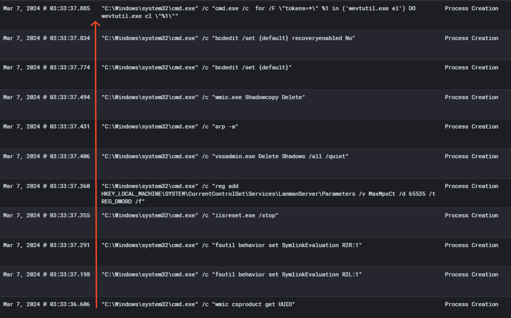

<br>

This final analysis conclude the investigation on `AlphV/BlackCat` ransomware group breach on `Waifu University`. For a deep dive into the analysis of the ransomware, you can check [this research article](https://securityscorecard.com/research/deep-dive-into-alphv-blackcat-ransomware/). 

---

## (＞ω＜) ♡ Conclusion ♡ (＞ω＜)

This APT emulation lab was the first one I had the opportunity to take on the platform and the first thing I can tell is that I was really surprised by the realism of the scenario. It actually covers real analysis and will definitely teach you skills that will be useful in your daily job.
After going through the lab, it almost feels like a senior threat hunter just taught me what he learnt and how we managed to investigate an AlphV/BlackCat incident response case. 🤓

<br>

I can tell **a LOOOT of work** was put into the creation of such a lab. I can only recommend it to anybody who is interested to the world of threat hunting or DFIR in general. It will be a great experience to actually practice on a real case scenario. And honestly, it's **really really** cheap for the amount of education you will get. Kudos to Xintra for making it this affordable, especially in this industry where most of the educational content (especially for infosec certification) prices are getting higher and higher. 

<br>

Big thanks to the team at Xintra & to the lab contributors ❤️ :
- [@ippsec](https://ippsec.rocks/?#) for the adversary emulation,
- [@DebugPrivilege](https://twitter.com/DebugPrivilege) for the lab design,
- [@svch0st](https://twitter.com/svch0st) - Incident responder, 
- [@InverseCos](https://twitter.com/inversecos) - Founder of Xintra.

<br>

If you have any feedback on my analysis, my methodology and my approach to this lab, please feel free to contact me Discord (@hashp4) or Twitter ([@hashp4_](https://twitter.com/hashp4_)). I would be happy to know how I could have done it differently / more efficiently! :)

<br>

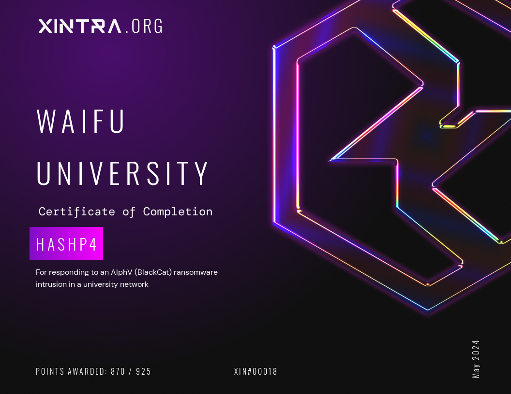

<br>

(Yes, I took some hints :P)

---

## Summary attack diagram

As a summary (and for fun), I made a diagram of what happened during the attack perpetrated by AlphV/BlackCat on Waifu University. I hope it may help you understand better the major events of this incident. 

<br>

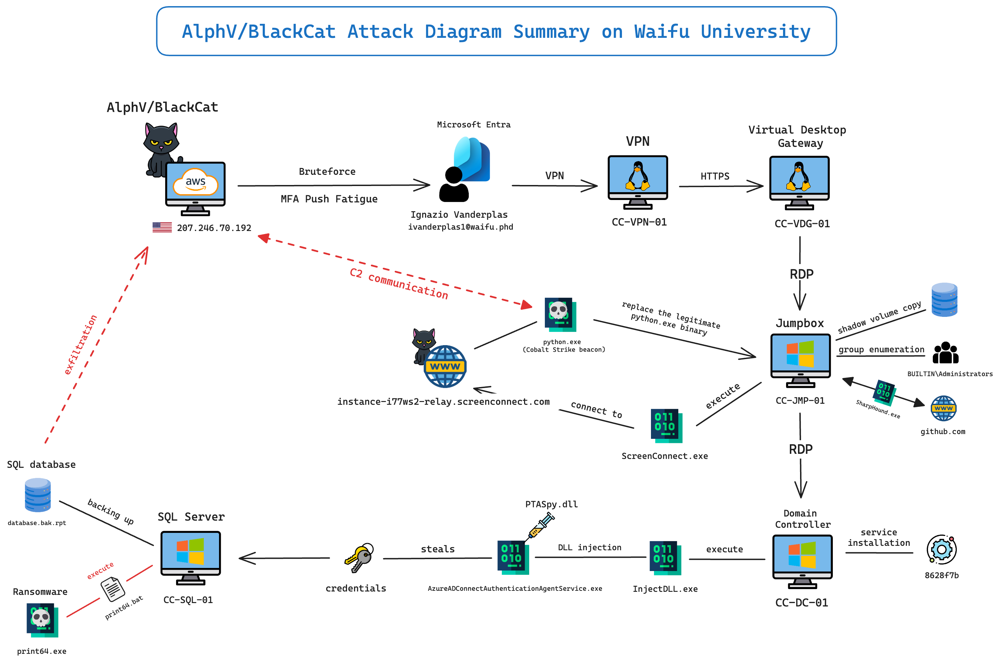

<br>

---

## Resources

Here are the interesting resources I found during the resolution of this lab.

- [Azure Event Log IDs bruteforce - Rezonate](https://www.rezonate.io/blog/defending-azure-active-directory/) 
- [Blackcat Ransomware article- Microsoft](https://www.microsoft.com/en-us/security/blog/2022/06/13/the-many-lives-of-blackcat-ransomware/)
- [Malware analysis of the Blackcat ransomware - SecurityScoreCard](https://securityscorecard.com/research/deep-dive-into-alphv-blackcat-ransomware/)
- [Pentest Cheatsheet for VSSAdmin - Github]( https://github.com/nixawk/pentest-wiki/blob/master/4.Post-Exploitation/Windows_ActiveDirectory/How-to-use-vssadmin.md)
- [SSH IP Fingerpint - SuperUser](https://superuser.com/questions/421997/what-is-a-ssh-key-fingerprint-and-how-is-it-generated)
- [UsnJournal explanation - Forensafe](https://forensafe.com/blogs/usnjournal.html)
- [Volume Shadow Copy explanation - ADSecurity](https://adsecurity.org/?p=451)

